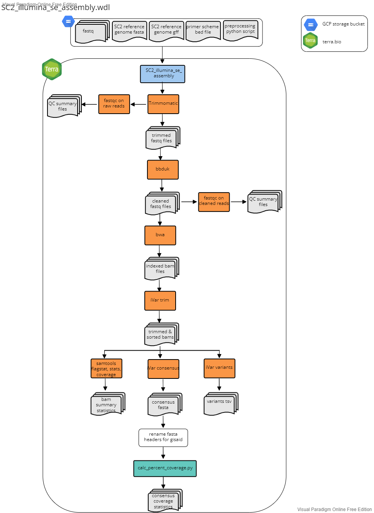

# SC2_illumina_se_assembly.wdl

**This workflow is no longer maintained**

## Overivew
This workflow was developed for the assembly of Illumina 72 bp single-end read data using the Illumina COVIDSEQ library prep protocol. The workflow accepts "sample" as the root entity type. The workflow will:
1. Use Trimmomatic and bbduk to quality filter, trim, and remove adapters from raw fastq files
  - Trimmomatic parameters inlcude a sliding widnow set to trim reads when the 4bp sliding window quality score falls below a mean Phred quality score of 30 (i.e. 4:30) and a minimum read lenght of 25 bp.
  - bbduck parameters include adapter trimming set to trim everything to the right of a kmer match and removal of PhiX sequences.
2. Run FastQC on both the raw and cleaned reads
3. Align reads to the reference genome using bwa and then sort the bam by coordinates using Samtools
4. Use iVar trim to trim primer regions and then sort the trimmed bam by coordinates using Samtools
5. Use iVar variants to call variants from the trimmed and sorted bam
  - iVar variants parameters include a minimum quality score set to 20, a minimum variant base frequency set to 0.6 and a minimum read depth set to 10.
6. Use iVar consensus to call the consensus genome sequence from the trimmed and sorted bam
  - iVar consensus parameters include a minimum quality score set to 20, a minimum variant base frequency set to 0.6 and a minimum read depth set to 10.
7. Use Samtools flagstat, stats, and coverage to output statistics from the bam
8. Rename the fasta header of consensus sequences in the format: CO-CDPHE{sample_id}
9. Calculate the percent coverage using the [calc_percent_coverage.py](./python_scripts/calc_percent_coverage.py) script available in the [python_scripts](./python_scripts/) directory of this repo.

 

 

## Inputs
1. Terra data table.

  The terra data table can be generated using the preprocess python scripts available in the [preprocess_python_scripts directory](./../preprocess_python_scripts) directory. The terra data table must include the following columns as listed below. Note that optional columns are not neccessary for the assembly workflow but but be present for the SC2_lineage_calling_and results.wdl and Transfer workflows described below under ``Lineage Calling Workflows`` and ``Transfer Workflows`` , respecitively.

  1. ``entity:sample_id``: column with the list of sample names/ids. Note that if there is more than one data table in the Terra Workspace, you need to add a number after the word sample to keep the datatables seperate (e.g. ``entity:sample2_id``).
  2. ``fastq``: The google bucket path to the fastq file.
  4. ``seq_run`` (optional): the name of the sequencing run (e.g. NEXSEQ_101)
  5. ``tech_platform`` (optional) : e.g. Illumina NexSeq
  6. ``read_type`` (optional): single
  7. ``primer_set`` (optional): e.g. COVIDSeqV3
  8. ``plate_name`` (optional): name of sequencing plate  
  9. ``plate_sample_well`` (optional): location of well on sequencing plate
  10. ``out_dir`` (optional): user defined google bucket fro where the files will be transfered during the transfer workflows.

2. Terra Workspace Data.

  The following reference files can be found in the [workspace_data](./workspace/) directory and the [python_scripts](./python_scripts/) directory. These files should be saved as Workspace data in your Terra Workspace. To do so, upload the files to a google bucket an link the file path to the wrokspace data variable. Once saved as workspace data variables, they can be used as inputs for the workflow.

  1. ``covid_genome``: the path to the google bucket directory contianing the SARS-CoV-2 reference genome fasta (we use NCBI genbank ID MN908947.3).
  2. ``covid_gff``: the path to the google bucket directory containing the SARS-CoV-2 reference genome gff annotation file (we use NCBI genbank ID MN908947.3)
  4. ``primer_bed``: the path to the google bucket directory containing a bed file with the primers used for amplicon sequencing
    - currenly we have bed files for Artic V3, Artic V4, Artic V4.1 and Midnight.
  5. ``preprocess_python_script``: [do we want to change the name of this variable in the WDL to match the python script name?] the path to the google bucket containing the ``calc_percent_coverage.py`` script.

Below is a summary of the workflow input variables along with the syntax used for the attribute column when setting up the workflow to run on Terra.bio. For the attributes, the "this." syntax refers Terra to pull the variable from the terra datatable (#1 above). The  "workspace." syntax refers Terra to pull the variable from the terra workspace data (#2 above).

|workflow variable| attribute (input syntax into workflow) |
|------------|-----------|
|``covid_genome``| workspace.covid_genome|
|``covid_gff``| workspace.covid_gff
|``fastq``| this.fastq|
|``preprocess_python_script``| workspace.preprocess_python_script|
|``primer_bed``|workspace.V4-1Artic|
|``sample_id``| this.sample{terra_datatable_name}_id|

## Outputs
1. Output files from Trimmomatic and ddbuk
  - ``trimmed_reads``: file
  - ``trim_stats``: file
  - ``filtered_reads`: file
  - ``adapter_stats``: file
  - ``PhiX_stats``: file

2. Output files from FastQC
  - ``fastqc_raw1_html``: file
  - ``fastqc_raw1_zip``: file
  - ``fastqc_raw2_html``: file
  - ``fastqc_raw2_zip``: file
  - ``fastqc_clean1_html``: file
  - ``fastqc_clean1_zip``: file
  - ``fastqc_clean2_html``: file
  - ``fastqc_clean2_zip``: file

3. Output files from bwa and samtools (align reads)
  - ``out_bam``: file

4. Output files from iVar trim and samtools
  - ``trim_bam``: file
  - ``trimsort_bam``: file
  - ``trimsort_bamindex``: file

5. Output files from iVar variants
  - ``variants``: vcf file formated as a tsv

6. Output files from iVar consensus
  - ``consensus``: fasta file of conensus genome, Ns are called in places with less than 10 bp read depth.  

7. Output files from Samtools flagstat, stats, and percent_coverage
  - ``fagstat_out``: file
  - ``stats_out``: file
  - ``covhist_out``: file
  - ``cov_out``: file

8. Output from rename consensus fasta headers
  - ``renamed_consensus``: fasta file; consesnus genome sequence with the fasta header renamed to be CO-CDPHE-{sample_id}

9. Output from calc_percent_coverage.py
  - ``percent_cvg_csv``: csv file, see calc_percent_cvg.py script readme for details.

10. bwa assembler version string output  
  - ``assembler_version``: string recording the version for bwa, this information is used later for submitting to public repositories.

 
