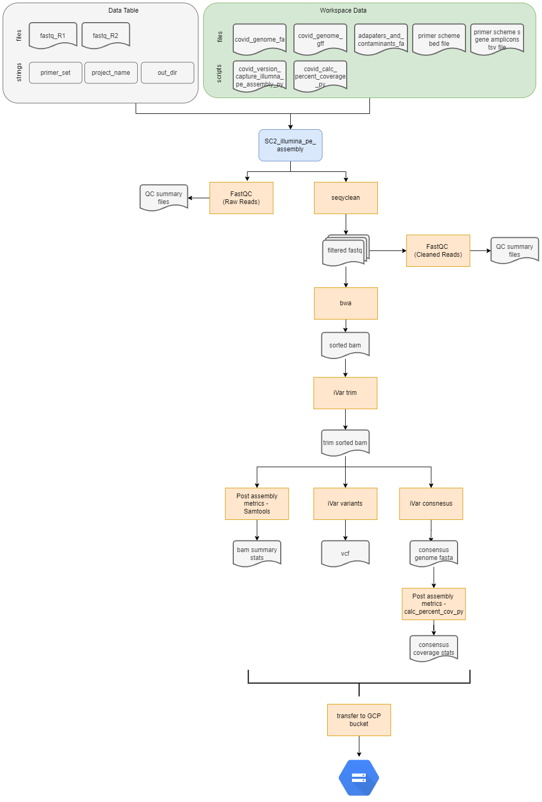

# SC2_illumina_pe_assembly Workflow

## Overview
This workflow was developed for the assembly of Illumina 150 bp paired-end read data using the Illumina Nextera XT library prep protocol. The workflow accepts "sample" as the root entity type. The following steps are preformed during the workflow:
1. Fastq files are quality filtered and trimed using Seqyclean 
    - Seqyclean parameters include a minimum read length set to 70 bp and quality trimming set to a minimum Phred quality score of 30.
2. FastQC is run on both the raw (pre filtering and trimming) and cleaned (post filtering and trimming) reads
3. Reads are aligned to the reference genome using bwa and then sorted by coordinates using Samtools.
4. Primer regions of reads are trimed using iVar trim and then the trimmed reads are sorted by coordinates using Samtools.
5. Variants are called relative to the reference genome using iVar variants. 
    - iVar variants parameters include a minimum quality score set to 20, a minimum variant base frequency set to 0.6 and a minimum read depth set to 10.
6. A consensus genome is generated using iVar consensus.
    - iVar consensus parameters include a minimum quality score set to 20, a minimum variant base frequency set to 0.6 and a minimum read depth set to 10.
7. Post assembly statistics, including mean seequencing depth and percent genome coverage, are calculated from the bam file using Samtools flagstat, stats, and coverage and a custom python script (calc_percent_coverage.py), respectively. 
8. The fasta header of the consensus sequence is renamed in the GISAID-acceptable format: CO-CDPHE-{sample_name}.
9. Workflow and software versions are recorded.
10. Intermediate files, consensus sequence fastas and post assembly summary stats files are transfered to a local GCP bucket for storage. 

 

 

## Inputs and Setup
 

### Terra data table

The terra data table must include the following columns as listed below. Note that optional columns are not neccessary for the assembly workflow but must be present for the ``SC2_lineage_calling_and results`` workflow. 

| column header | description | 
|-------------------|-----------------|
| ``entity:{sample}_id``| Column with the list of sample names, where ``{sample}`` can be replaced with a descriptor. For example the header could be: ``entity:covwwt-0203_id``. Each sample name within this column must be unique. This column must be the first column of the data table. |
| ``fastq_1``| The google bucket path to the R1 fastq file.|
|``fastq_2``| The google bucket path to the R2 fastq file.|
|``out_dir``| User defined google bucket for where the files will be transfered during the transfer workflows. |
|``terra_data_table_path``| The GCP bucket path to the terra data table location.  (optional; required for lineage calling workflow) | 
|``project_name``| The name of the sequencing project. |

 

### Terra Workspace Data.

see the SC2_workflows_overview readme for which workspace data elements are required and how to add the correct files to your workspace data. 

 

### Setting up the workflow inputs
Navigate to the workflow launch page within your Terra workspace. On the launch page:
1. Select the correct version of the workflow. Be sure to select the latest release. Other branches or versions are not garanteed to run successfully and are considered develop versions.
2. Choose the data table, being sure to select root entity type as ``sample``. Then select the samples from the data table you want to include in the anlaysis. 
3. Set up the workflow inputs as follows in the table below (you can also use the available example json input file under the data directory): 

    |Workflow Variable| Type| Attribute (input syntax into workflow) |
    |------------|-----------|---------------------------------------|
    |``adapters_and_contaminants``| File |workspace.adapters_and_contaminants_fa|
    |``calc_percent_coverage_py``| File| workspace.covid_calc_percent_coverage_py|
    |``covid_genome``|File| workspace.covid_genome_fa|
    |``covid_gff``|File| workspace.covid_genome_gff|
    |``fastq_1``|File| this.fastq_1|
    |``fastq_2``|File| this.fastq_2|
    |``primer_bed``|File| workspace.artic_v4-1_bed (or desired primer set)|
    |``project_name``| String | this.project_name |
    |``s_gene_amplicons``|File|workspace.artic_v4-1_s_gene_amplicons (or desired primer set)|
    |``sample_name``|String| this.{entity_name}_id| 
    |``version_capture_illumina_pe_assembly_py``|File| workspace.covid_version_capture_illumina_pe_assembly_py|

4. Select ``Use Defaults`` for outputs. 

 

## Outputs

The table below lists the following outputs that are generated during the workflow and can be accessed through the terra data table once the workflow finishes. The WDL task name indicates the task in the WDL where the output was generated. The software/program indicates the software/program that was used in the WDL task to generate the output. The variable name will be the name of the column header generated in the terra data table where the result value or file will be stored/located. The description will state whether the file is transferred to a local GCP storage bucket. If it is not transferred the output can only be accessed via Terra's backend GCP storage buckets and/or the terra data table. 

| WDL task name | software/program | variable name | description | 
|---------------|------------------|---------------|-------------|
|seqyclean| seqyclean| ``filtered_reads_1``| fastq file|
|seqyclean| seqyclean| ``filtered_reads_2``| fastq file|
|seqyclean| seqyclean| ``seqyclean_summary``| file; transfered to local GCP storage bucket|
|fastqc as fastqc_raw| fastqc| ``fastqc_raw1_html``| file; transfered to local GCP storage bucket|
|fastqc as fastqc_raw| fastqc| ``fastqc_raw1_zip``| file; transfered to local GCP storage bucket|
|fastqc as fastqc_raw| fastqc| ``fastqc_raw2_html``| file; transfered to local GCP storage bucket|
|fastqc as fastqc_raw| fastqc| ``fastqc_raw2_zip``| file; transfered to local GCP storage bucket|
|fastqc as fastqc_cleaned| fastqc| ``fastqc_clean1_html``| file; transfered to local GCP storage bucket|
|fastqc as fastqc_cleaned| fastqc| ``fastqc_clean1_zip``| file; transfered to local GCP storage bucket|
|fastqc as fastqc_cleaned| fastqc|``fastqc_clean2_html``| file; transfered to local GCP storage bucket|
|fastqc as fastqc_cleaned| fastqc| ``fastqc_clean2_zip``| file; transfered to local GCP storage bucket|
|align_reads|bwa, samtools| ``out_bam``| bam file|
|align_reads|bwa, samtools| ``out_bamindex``| bai file|
|ivar trim |ivar trim, samtools| ``trim_bam`` | bam file|
|ivar trim |ivar trim, samtools| ``trimsort_bam`` | bam file; transfered to local GCP storage bucket|
|ivar trim |ivar trim, samtools| ``trimsort_bamindex`` | bai file; transfered to local GCP storage bucket|
|ivar variants| ivar variants| ``variants``| vcf file formatted as a tsv; transfered to local GCP storage bucket|
|ivar consensus| ivar consnesus| ``consensus``| fasta file of conensus genome, Ns are called in places with less than 10 bp read depth; transfered to local GCP storage bucket |
|bam_stats|samtools flagstat, stats, percent_coverage | ``flagstat_out``| txt file; transfered to local GCP storage bucket|
|bam_stats|samtools flagstat, stats, percent_coverage | ``stats_out``| txt file; transfered to local GCP storage bucket|
|bam_stats|samtools flagstat, stats, percent_coverage |  ``covhist_out``| txt file; transfered to local GCP storage bucket|
|bam_stats|samtools flagstat, stats, percent_coverage |  ``cov_out``|txt file; transfered to local GCP storage bucket|
|bam_stats|samtools flagstat, stats, percent_coverage | ``cov_s_gene_amplcions_out``| file; transfered to local GCP storage bucket|
|bam_stats|samtools flagstat, stats, percent_coverage | ``cov_s_gene_out``|file; transfered to local GCP storage bucket|
|rename_fasta| N/A | ``renamed_consensus``|fasta file; consesnus genome sequence with the fasta header renamed to be CO-CDPHE-{sample_name}; transfered to local GCP storage bucket|
|calc_percent_cvg|calc_percent_coverage.py| ``percent_cvg_csv``|csv file, see calc_percent_cvg.py script readme for details found in the ./python_scripts directory of this repository.|
|create_version_capture_file| version_capture_illumina_pe_assembly.py| ``version_capture_illumina_pe_assembly``| csv file; transfered to local GCP storage bucket|
|transfer| gsutil | ``transfer_date_assembly``| string|

 
 