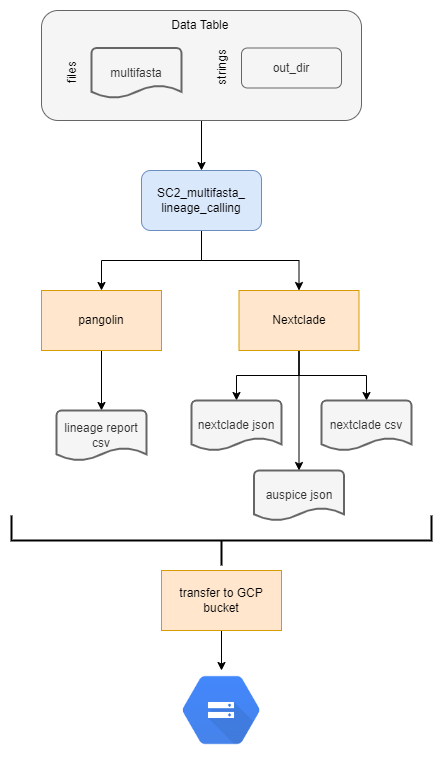

# SC2_multifasta_lineage_calling Workflow

## Overview

This workflow will perfrom lineage and clade assignment using a concatenated fasta file as input. This workflow is a stand alone workflow and does not depend on any of the previous reference-based assembly workflows. The workflow accepts "sample" as the root entity type and uses a simple two column data table (see inputs below).

Brienfly this workflow will perform the following:
1. Runs nextclade on a multifasta sequence file.
2. Runs panoglin on a multifasta sequence file.
3. Transfers outputs to a user defined google bucket.

 

 

## Inputs and Setup
 

### Terra data table

The terra data table must include the following columns as listed below.  

| column header | description | 
|-------------------|-----------------|
| ``entity:{sample}_id``| Column with the list of sample names, where ``{sample}`` can be replaced with a descriptor.  Each sample name within this column must be unique. Must be the first column. |
| ``multifasta``| The google bucket path to the multi-fasta file. |
|``out_dir``| User defined google bucket for where the files will be transfered. This can also be omitted from the data table and entered as a string when setting up the workflow. |

 

### Terra Workspace Data.

No workspace data is required for this workflow.

 

### Setting up the workflow inputs
Navigate to the workflow launch page within your Terra workspace. On the launch page:
1. Select the correct version of the workflow. Be sure to select the latest release. Other branches or versions are not garanteed to run successfully and are considered develop versions.
2. Choose the data table, being sure to select root entity type as ``sample``. Then select the samples from the data table you want to include in the anlaysis. 
3. Set up the workflow inputs as follows in the table below (you can also use the available example json input file under the data directory): 

    |Workflow Variable| Type| Attribute (input syntax into workflow) |
    |------------|-----------|---------------------------------------|
    |``multifasta``| String | this.multifasta|
    |``sample_id``| String| this.this.{entity_name}_id |
    |``out_dir``|File| this.out_dir |

4. Select ``Use Defaults`` for outputs. 

 

## Outputs

The table below lists the following outputs that are generated during the workflow and can be accessed through the terra data table once the workflow finishes. The WDL task name indicates the task in the WDL where the output was generated. The software/program indicates the software/program taht was used in the WDL task to generate the output. The variable name will be the name of the column header generated in the terra data table where the result value or file will be stored/located. The description will state whether the file is transferred to a local GCP storage bucket. If it is not transferred the output can only be accessed via Terra's backend GCP storage buckets and/or the terra data table. 

| WDL task name | software/program | variable name | description | 
|---------------|------------------|---------------|-------------|
|nextclade| nextclade | ``nextclade_version``| nextclade version used; output is a string in the data table|
|nextclade| nextclade| ``nextclade_json``| nextclade json file; transferred to local GCP storage bucket|
|nextclade| nextclade| ``auspice_json``| nextclade auspice json file; transfered to local GCP storage bucket|
|nextclade| nextclade| ``nextclade_csv``| nextclade csv file; transfered to local GCP storage bucket|
|pangolin| pangolin| ``pangolin_version``| pangolin version used; output is a string in the data table|
|pangolin| pangolin| ``pangolin_lineage``| lineage results csv file; transfered to local GCP storage bucket|
