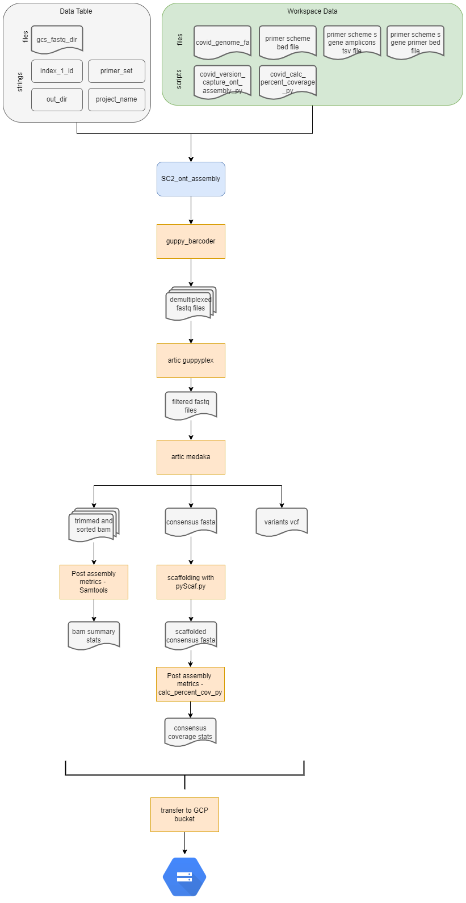

# SC2_ont_assembly Workflow

## Overview
This workflow was developed for the assembly of Oxford Nanopore Technology (ONT) read data following the ARTIC SARS-CoV-2 sequencing protocol and using the ONT native barcoding kit. This workflow is based off of the nCoV-2019 novel coronavirus bioinfroamtics protocol: https://artic.network/ncov-2019/ncov2019-bioinformatics-sop.html. This workflow assumes that basecalling and conversion of fast5 files into fastq has already occurred (e.g. using MinKNOW). The workflow accepts "sample" as the root entity type. The following steps are preformed during the workflow:

1. Barcodes are removed from raw sequencing reads using guppy_barcoder.
2. Raw reads are quality filtered using guppyplex.
    -  guppyplex inlcudes a min length parameter set to 400 and a max length set to 700 for Artic primers and a min lingth set ot 400 and a max length set to 1500 for midnight primers.
3. Variant calling is performed and a consensus sequence generated using artic minion --medaka 
    - medaka uses minimap2 by default to align reads to the SARS-CoV-2 reference genome
    - the default parameter in medaka for base calling is 20x depth and at least 60% of reads containing the base call
4. Scaffold assembly using pyScaf
    - this step ensures a single continuous consensus sequence with only one sequence in the consensus fasta file
5. The fasta header of the consensus sequence is renamed in the GISAID-acceptable format: CO-CDPHE-{sample_name}.
6. Post assembly statistics, including mean seequencing depth and percent genome coverage, are calculated from the bam file using Samtools flagstat, stats, and coverage and a custom python script (calc_percent_coverage.py), respectively.
7. Workflow and software versions are recorded.
8. Intermediate files, consensus sequence fastas and post assembly summary stats files are transfered to a local GCP bucket for storage. 

 

 

## Inputs and Setup
 

### Terra data table

The terra data table must include the following columns as listed below. Note that optional columns are not neccessary for the assembly workflow but must be present for the ``SC2_lineage_calling_and results`` workflow. 

| column header | description | 
|-------------------|-----------------|
| ``entity:{sample}_id``| Column with the list of sample names, where ``{sample}`` can be replaced with a descriptor. For example the header could be: ``entity:cov-1984-grid_id``. Each sample name within this column must be unique.|
| ``fastq_dir``| The google bucket path to the barcode directory of fastq.gz files.|
|``out_dir``| User defined google bucket for where the files will be transfered during the transfer workflows. |
|``terra_data_table_path``| The GCP bucket path to the terra data table location.  (optional; required for lineage calling workflow) | 
|``project_name``| The name of the sequencing project. |

 

### Terra Workspace Data.

see the SC2_workflows_overview readme for which workspace data elements are required and how to add the correct files to your workspace data. 

 

### Setting up the workflow inputs
Navigate to the workflow launch page within your Terra workspace. On the launch page:
1. Select the correct version of the workflow. Be sure to select the latest release. Other branches or versions are not garanteed to run successfully and are considered develop versions.
2. Choose the data table, being sure to select root entity type as ``sample``. Then select the samples from the data table you want to include in the anlaysis. 
3. Set up the workflow inputs as follows in the table below (you can also use the available example json input file under the data directory): 

    |Workflow Variable| Type| Attribute (input syntax into workflow) |
    |------------|-----------|---------------------------------------|
    |``calc_percent_coverage_py``| File| workspace.covid_calc_percent_coverage_py|
    |``covid_genome``|File| workspace.covid_genome_fa|
    |``gsc_fastq_dir``|String| this.fastq_dir|
    |``index_1_id``|String|this.index_1_id|
    |``primer_bed``|File| workspace.artic_v4-1_bed (or desired primer set)|
    |``primer_set``| String | this.primer_set|
    |``project_name``| String | this.project_name| 
    |``s_gene_amplicons``|File|workspace.artic_v4-1_s_gene_amplicons (or desired primer set)|
    |``s_gene_primer_bed``| File | workspace.artic_v4-1_s_gene_bed (or desired_primer_set) |
    |``sample_name``|String| this.{entity_name}_id| 
    |``version_capture_ont_assembly_py``|File| workspace.covid_version_capture_ont_assembly_py|

4. Select ``Use Defaults`` for outputs. 

 

## Outputs

The table below lists the following outputs that are generated during the workflow and can be accessed through the terra data table once the workflow finishes. The WDL task name indicates the task in the WDL where the output was generated. The software/program indicates the software/program taht was used in the WDL task to generate the output. The variable name will be the name of the column header generated in the terra data table where the result value or file will be stored/located. The description will state whether the file is transferred to a local GCP storage bucket. If it is not transferred the output can only be accessed via Terra's backend GCP storage buckets and/or the terra data table. 

| WDL task name | software/program | variable name | description |
|---------------|------------------|---------------|-------------|
|Demultiplex|guppy_barcode| ``index_1_id_summary`` | file |
|Demultplex | guppy_barcode | ``guppy_demux_fastq`` |  file |
|Read_Filtering|artic guppyplex| ``filtered_fastq``| filtered fastq file|
|Medaka | medaka and minimap2 | ``sorted_bam`` | bam file |
|Medaka | medaka and minimap2 | ``trimsort_bam``|bam file; transfered to local GCP storage bucket |
|Medaka | medaka and minimap2 | ``trimsort_bai``| bai file; transfered to local GCP storage bucket|
|Medaka | medaka and minimap2 | ``variants``|vcf file|
|Medaka | medaka and minimap2 | ``consensus``| fasta file|
|Bam_stats | samtools | ``flagstat_out`` | text file; transfered to local GCP storage bucket|
|Bam_stats | samtools | ``stats_out`` | text file; transfered to local GCP storage bucket|
|Bam_stats | samtools | ``covhist_out``| text file; transfered to local GCP storage bucket |
|Bam_stats | samtools | ``cov_out`` | text file; transfered to local GCP storage bucket |
|Bam_stats | samtools | ``cov_s_gent_out`` | text file; transfered to local GCP storage bucket | 
|Bam_stats | samtools | ``cov_s_gene_amplicons_out`` | text file; transfered to local GCP storage bucket|
|Scaffold | pyScaf | ``scaffold_consensus`` | fasta file|
|rename_fasta | bash | ``renamed_consensus``|fasta file; transfered to local GCP storage bucket| 
|calc_percent_cvg | calc_percent_coverage.py | ``percent_cvg_csv``| csv file|
|get_primer_site_variants | bcf ools | ``primer_site_variants`` | vcf file (as text file); transfered to local GCP storage bucket | 
|create_version_capture_file | version_capture_ont_assembly.wdl | csv file; transferred to local GCP storage | 
| transfer | gsutil | ``transfer_date_assembly`` | string | 

 
 

