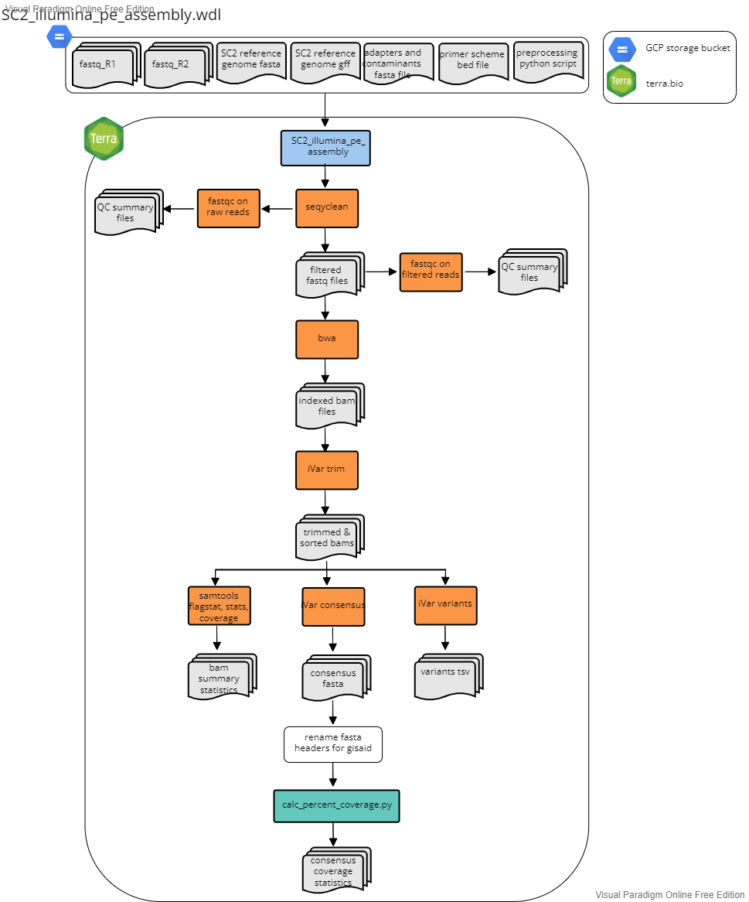
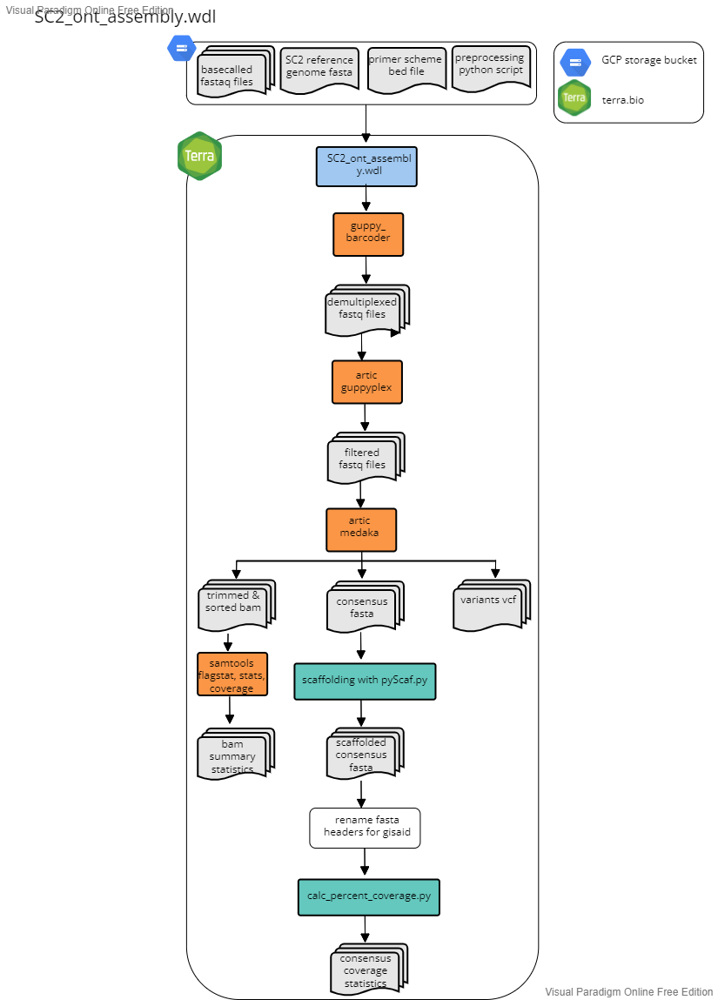

# Assembly Workflows

The following three workflows describe the reference based assembly methods for paired-end sequencing data and ONT sequencing data. Each workflow accepts "sample" as the root entity type.

## Illumina PE

File: SC2_illumina_pe_assembly.wdl

This workflow was developed for the assembly of Illumina 150 bp paired-end read data using the Illumina Nextera XT library prep protocol. The workflow accepts "sample" as the root entity type. The workflow will:

1. Perform human read scrubbing on the fastq files using [hostile](https://github.com/bede/hostile) if `scrub_reads` is set to true.
2. Use Seqyclean to quality filter and trim raw fastq files
    - Seqyclean parameters include a minimum read length set to 70 bp and quality trimming set to a minimum Phred quality score of 30.
3. Run FastQC on both the raw and cleaned reads
4. Align reads to the reference genome using bwa and then sort the bam by coordinates using Samtools
5. Use iVar trim to trim primer regions and then sort the trimmed bam by coordinates using Samtools
6. Use iVar variants to call variants from the trimmed and sorted bam
   - iVar variants parameters include a minimum quality score set to 20, a minimum variant base frequency set to 0.6 and a minimum read depth set to 10.
7. Use iVar consensus to call the consensus genome sequence from the trimmed and sorted bam
   - iVar consensus parameters include a minimum quality score set to 20, a minimum variant base frequency set to 0.6 and a minimum read depth set to 10.
8. Use Samtools flagstat, stats, and coverage to output statistics from the bam
9. Rename the fasta header of consensus sequences in the GISAID-acceptable format: CO-CDPHE-{sample_id}
10. Calculate the percent coverage using the `calc_percent_coverage.py` script available in the [python_scripts](https://github.com/CDPHE-bioinformatics/CDPHE-SARS-CoV-2/tree/main/workflows/python_scripts) directory of this repo.

### Inputs

#### 1. Terra Data Table

The terra data table must include the following columns as listed below. Note that optional columns are not necessary for the assembly workflow but must be present for the SC2_lineage_calling_and results.wdl and Transfer workflows described below under `Lineage Calling Workflows` and `Transfer Workflows`, respectively.

| column header      | description                                                                                      |
| ------------------ | ------------------------------------------------------------------------------------------------ |
| `entity:sample_id` | column with the list of sample names. (e.g. `entity:covwwt-0203_id`)                             |
| `fastq_1`          | The google bucket path to the R1 fastq file.                                                     |
| `fastq_2`          | The google bucket path to the R2 fastq file.                                                     |
| `out_dir`          | User defined google bucket for where the files will be transferred during the transfer workflows. |
| `workbook_path`    | (optional; required for lineage calling workflow)                                                |
| `project_name`     | (optional; required for lineage calling workflow)                                                |

#### 2. Terra Workspace Data

See [setup](setup.md).

#### 3. Setting Up the Workflow Inputs

For setting up the workflow inputs, use the `SC2_illumina_pe_assembly-input.json` in the `workflow_inputs` directory.

| workflow variable           | attribute (input syntax into workflow)   |
| --------------------------- | ---------------------------------------- |
| `adapters_and_contaminants` | workspace.adapters_and_contaminants_fa   |
| `calc_percent_coverage_py`  | workspace.covid_calc_percent_coverage_py |
| `covid_genome`              | workspace.covid_genome_fa                |
| `covid_gff`                 | workspace.covid_genome_gff               |
| `fastq_1`                   | this.fastq_1                             |
| `fastq_2`                   | this.fastq_2                             |
| `out_dir`                   | this.out_dir                             |
| `overwrite`                 | `true` or `false`                        |
| `primer_bed`                | workspace.artic_v4-1_bed                 |
| `project_name`              | this.project_name                        |
| `s_gene_amplicons`          | workspace.artic_v4-1_s_gene_amplicons    |
| `sample_name`               | this.{entity_name}\_id                   |
| `scrub_reads`               | `true` or `false`                        |
| `scrub_genome_index`        | workspace.hostile_human_t2t_hla_bt2 (if using read scrubbing)  |
| `version_capture_py`        | workspace.version_capture_py             |

### Outputs

| WDL task name            | software/program                           | variable name                | description                                                                                                             |
| ------------------------ | ------------------------------------------ | ---------------------------- | ----------------------------------------------------------------------------------------------------------------------- |
| hostile                  | hostile                                    | `human_reads_removed`      | integer                                                                                                                   |
| hostile                  | hostile                                    | `human_reads_removed_proportion` | floating-point number                                                                                               |
| hostile                  | hostile                                    | `fastq1_scrubbed`          | file
| hostile                  | hostile                                    | `fastq2_scrubbed`          | file
| seqyclean                | seqyclean                                  | `filtered_reads_1`         | file                                                                                                                    |
| seqyclean                | seqyclean                                  | `filtered_reads_2`         | file                                                                                                                    |
| seqyclean                | seqyclean                                  | `seqyclean_summary`        | file                                                                                                                    |
| fastqc as fastqc_raw     | fastqc                                     | `fastqc_raw1_html`         | file                                                                                                                    |
| fastqc as fastqc_raw     | fastqc                                     | `fastqc_raw1_zip`          | file                                                                                                                    |
| fastqc as fastqc_raw     | fastqc                                     | `fastqc_raw2_html`         | file                                                                                                                    |
| fastqc as fastqc_raw     | fastqc                                     | `fastqc_raw2_zip`          | file                                                                                                                    |
| fastqc as fastqc_cleaned | fastqc                                     | `fastqc_clean1_html`       | file                                                                                                                    |
| fastqc as fastqc_cleaned | fastqc                                     | `fastqc_clean1_zip`        | file                                                                                                                    |
| fastqc as fastqc_cleaned | fastqc                                     | `fastqc_clean2_html`       | file                                                                                                                    |
| fastqc as fastqc_cleaned | fastqc                                     | `fastqc_clean2_zip`        | file                                                                                                                    |
| align_reads              | bwa and samtools                           | `out_bam`                  | file                                                                                                                    |
| align_reads              | bwa and samtools                           | `out_bamindex`             | file                                                                                                                    |
| ivar trim                | ivar trim and samtools                     | `trim_bam`                 | file                                                                                                                    |
| ivar trim                | ivar trim and samtools                     | `trimsort_bam`             | file                                                                                                                    |
| ivar trim                | ivar trim and samtools                     | `trimsort_bamindex`        | file                                                                                                                    |
| ivar variants            | ivar variants                              | `variants`                 | vcf file formatted as a tsv                                                                                             |
| ivar consensus           | ivar consensus                             | `consensus`                | fasta file of consensus genome, Ns are called in places with less than 10 bp read depth.                                |
| bam_stats                | samtools flagstat, stats, percent_coverage | `flagstat_out`             | file                                                                                                                    |
| bam_stats                | samtools flagstat, stats, percent_coverage | `stats_out`                | file                                                                                                                    |
| bam_stats                | samtools flagstat, stats, percent_coverage | `covhist_out`              | file                                                                                                                    |
| bam_stats                | samtools flagstat, stats, percent_coverage | `depth_out`                | file
| bam_stats                | samtools flagstat, stats, percent_coverage | `cov_out`                  | file                                                                                                                    |
| bam_stats                | samtools flagstat, stats, percent_coverage | `cov_s_gene_amplicons_out` | file                                                                                                                    |
| bam_stats                | samtools flagstat, stats, percent_coverage | `cov_s_gene_out`           | file                                                                                                                    |
| rename_fasta             | N/A                                        | `renamed_consensus`        | fasta file; consensus genome sequence with the fasta header renamed to be CO-CDPHE-{sample_name}                        |
| calc_percent_cvg         | calc_percent_coverage.py                   | `percent_cvg_csv`          | csv file, see calc_percent_cvg.py script readme for details found in the ./python_scripts directory of this repository. |
| version_capture          | version_capture.py                         | `version_capture_illumina_pe_assembly` | csv file                                                                                                    |
| transfer                 | gsutil                                     | `transfer_date_assembly`   | String                                                                                                                  |

## Illumina SE

This workflow has been removed. The workflow and its documentation can still be accessed from the v2.4.1 release.

## Oxford Nanopore Technologies (ONT)

File: SC2_ont_assembly.wdl

This workflow was developed for the assembly of Oxford Nanopore Technology (ONT) read data following the ARTIC SARS-CoV-2 sequencing protocol and using the ONT native barcoding kit. This workflow assumes that base calling and conversion of fast5 files into fastq has already occurred (e.g. using MinKNOW). The workflow accepts "sample" as the root entity type. The workflow will:

1. Perform human read scrubbing on concatenated fastq files using [hostile](https://github.com/bede/hostile) if `scrub_reads` is set to true.
2. Demuliplex basecalled fastq files using guppy_barcoder
3. Perform quality filtering using guppyplex
    - guppyplex includes a min length parameter set to 400 and a max length set to 700 for Artic primers and a min length set ot 400 and a max length set to 1500 for midnight primers.
4. Run artic minion for variant calling and to generate a consensus flagstat_out
    - align reads to the SARS-CoV-2 reference genome
5. Scaffold assembly with pyScaf
    - this step ensures a single continuous consensus sequence with only one sequence in the consensus fasta file
6. Rename consensus to CO-CDPHE-{sample_id}
7. Generate bam quality statistics using samtools
8. Calculates percent coverage using the `calc_percent_coverage.py` script

### Inputs

#### 1. Terra Data Table

The terra data table can be generated using the pre-process python scripts available in the [data preprocessing repository](https://github.com/CDPHE-bioinformatics/seq_data_preprocessing-private). The terra data table must include the following columns as listed below. Note that optional columns are not necessary for the assembly workflow but but be present for the SC2_lineage_calling_and results.wdl and Transfer workflows described below under `Lineage Calling Workflows` and `Transfer Workflows`, respectively.

| column header      | description                                                                                      |
| ------------------ | ------------------------------------------------------------------------------------------------ |
| `entity:sample_id` | column with the list of sample names. (e.g. `entity:covwwt-0203_id`)                             |
| `index_1_id`       | the ont barcode associated with the sample                                                       |
| `fastq_dir`        | the google bucket path with the set of fastq files                                               |
| `out_dir`          | User defined google bucket for where the files will be transferred during the transfer workflows. |
| `workbook_path`    | (optional; required for lineage calling workflow)                                                |
| `project_name`     | (optional; required for lineage calling workflow)                                                |

#### 2. Terra Workspace Data

See [setup](setup.md).

#### 3. Setting Up the Workflow Inputs

For setting up the worklfow inputs, use the `SC2_ont_assembly-input.json` in the `workflow_inputs` directory.

| workflow variable          | attribute (input syntax into workflow)   |
| -------------------------- | ---------------------------------------- |
| `calc_percent_coverage_py` | workspace.covid_calc_percent_coverage_py |
| `covid_genome`             | workspace.covid_genome_fa                |
| `gcs_fastq_dir`            | this.fastq_dir                           |
| `index_1_id`               | this.index_1_id                          |
| `out_dir`                   | this.out_dir                             |
| `overwrite`                 | `true` or `false`                        |
| `primer_bed`               | workspace.artic_v4-1_bed                 |
| `primer_set`               | this.primer_set                          |
| `project_name`              | this.project_name                        |
| `s_gene_amplicons`         | workspace.artic_v4-1_s_gene_amplicons    |
| `s_gene_primer_bed`        | workspace.artic_v4-1_s_gene_primer_bed   |
| `sample_name`              | this.{entity_name}\_id                   |
| `scrub_reads`              | `true` or `false`                        |
| `scrub_genome_index`       | workspace.hostile_human_t2t_hla_fa_gz (if using read scrubbing) |
| `model`             | (optional, leave blank for auto-detection) example: "r1041_e82_400bps_hac_v4.2.0"   |
| `barcode_kit`              | example: "SQK-NBD114-96"                 |
| `version_capture_py`       | workspace.version_capture_py             |

### Outputs

| WDL task name               | software/program                           | variable name          | description                                                                                                             |
| --------------------------- | ------------------------------------------ | ---------------------- | ----------------------------------------------------------------------------------------------------------------------- |
| Demultiplex                 | guppy_barcoder                             | `barcode_summary`      | file                                                                                                                    |
| Demultiplex                 | guppy_barcoder                             | `guppy_dmux_fastq`     | file                                                                                                                    |
| Read_Filtering              | guppyplex quality filtering                | `filtered_fastq`       | file                                                                                                                    |
| hostile                     | hostile                                    | `fastq_files_scrubbed` | file                                                                                                                    |
| hostile                     | hostile                                    | `human_reads_removed`  | integer                                                                                                                 |
| hostile                     | hostile                                    | `human_reads_removed_porportion` | floating-point number                                                                                         |
| call_consensus_artic        | artic minion                               | `sorted_bam`           | file                                                                                                                    |
| call_consensus_artic        | artic minion                               | `trim_sort_bam`        | file                                                                                                                    |
| call_consensus_artic        | artic minion                               | `trimsort_bai`         | file                                                                                                                    |
| call_consensus_artic        | artic minion                               | `variants`             | file                                                                                                                    |
| call_consensus_artic        | artic minion                               | `consensus`            | file                                                                                                                    |
| call_consensus_artic        | artic minion                               | `assembler_version`    | string recording the version for artic medaka, this information is used later for submitting to public repositories.    |
| Bam_stats                   | samtools flagstat, stats, percent_coverage | `flagstat_out`         | file                                                                                                                    |
| Bam_stats                   | samtools flagstat, stats, percent_coverage | `stats_out`            | file                                                                                                                    |
| Bam_stats                   | samtools flagstat, stats, percent_coverage | `covhist_out`          | file                                                                                                                    |
| Bam_stats                   | samtools flagstat, stats, percent_coverage | `cov_out`              | file                                                                                                                    |
| Scaffold                    | pyScaf                                     | `scaffold_consensus`   | consensus sequence as a fasta file                                                                                      |
| rename_fasta                | N/A                                        | `renamed_consensus`    | fasta file; consensus genome sequence with the fasta header renamed to be CO-CDPHE-{sample_name}                        |
| calc_percent_cvg            | calc_percent_coverage.py                   | `percent_cvg_csv`      | csv file, see calc_percent_cvg.py script readme for details found in the ./python_scripts directory of this repository. |
| get_primer_site_variants    | bcftools                                   | `primer_site_variants` | file                                                                                                                    |
| version_capture             | version_capture.py                         | `version_capture_ont_assembly` | csv file                                                                                                    |
| transfer                    | gsutil                                     | `transfer_date_assembly`   | String                                                                                                                  |
