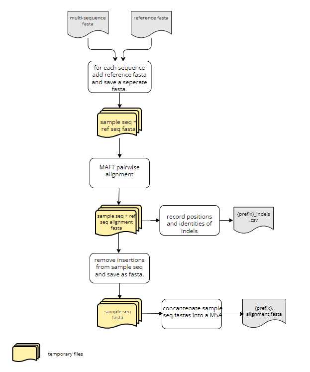

# SARS-CoV-2 Indel Finder

This python script accomplishes the following:

- takes a set of sars-cov-2 sequences (either as a multi sequence fasta or a directory of single sequence fasta files) and aligns each to the reference genome (pairwise alignment)
- identifies all insertions and deletions within each sample sequence and generates an output table
- removes nucleotide insertions from sample sequences
- using the pair-wise alignments generates a MSA (multi sequence alignment) output alignment fasta which can be used for tree building.

## Requirements

- The python modules neccessary to run this script are contained in a conda environment; therefore you must have Anaconda or miniconda installed.
- MAFFT seqeunce aligner (we used v7.471)

## Preparing your environment

This only needs to be performed the first time you run the script.

1. Clone the repository to your machine and change directories to the repository on your machine:

        git clone https://github.com/CDPHE/sars-cov-2_indel_finder
        cd sars-cov-2_indel_finder

2. Create the conda environment using the `environment.yml` file. The environment's name should be `indel_finder_env`:

        conda env create -f environment.yml

3. If the environment already exists then to update the environment:

        conda env update -f environment.yml

4. Check that the environment exists. The name of the enivornment should be `indel_finder_env`:

        conda env list

5. Activate the conda environment:

        conda activate indel_finder_env

## Inputs

1. Sample sequences either as:
    - a multi sequence fasta file
    - directory with single sequence fasta files
2. Reference genome saved as a fasta file

## Running the script

1. Activate the conda environment:

        conda activate indel_finder_env

2. Run the script usinig the following flags:
    - `-i`: either the path to the multi sequence fasta or the path to the directory wtih single sequence fasta files
    - `-o` : path to where you would like the outputs to go
    - `ref_path`: path to the reference genome
    - `--prefix`: (optional) prefix used to save outputs, if not specified will default to today's date
    - note use complete paths!!
3. Putting it all together:

        indel_finder.py -i <multi_sequence.fasta> -o . --ref_path <path_to_ref_genome> --prefix <prefix>

## Outputs

1. `<prefix>_indels.csv` : table providing the sequence name, the nucleotide bps of the indel (either (+) for insertions or (-) for deletions), the start position of the indel, the length of the indel, and the 7 upstream and 7 downstream nucleotides surrounding the indel.
2. `<prefix>.aligment.fasta` : MSA

## Changelog

### Update (2021-12-05)

- `indel_finder_pairwise_aligner.py` only identifies insertionss and does not remove them, therefore the final sequence length will not be 29903 if there is an insertion present.
- for the output- there are two columns for the start position. "ref_start_pos" refers to the location on the reference genome where the insertion is and "seq_start_pos" refers to the position on the sample sequence where the insertion begins. These columns are also included for deletions; however only the "seq_start_pos" will be filled in because I haven't thought of a good way to get the ref_start_pos yet. It gets a bit sticky when there are insertions and deletions in the same sample sequence.

### Update (2021-11-29)

- the omicron variant has an known 9 bp insertion right after bp 22204 in the reference genome
- `indel_finder_omicron.py` accounts for this insertion and does not remove it; however this means that the final output is no longer a multisequence alignment (MSA). If the 9 bp insertion at 22204 is found then the script does not remove it (a note 'ins not removed' is included in the indel.csv output) and the final length of the genome will be 29912 (not 29903). This means that sequences in the ".aligment.fasta" output could be 29912 or 29903 in length. Thus this is not a true MSA and cannot be used for tree building.
- all inputs and outputs are the same for `indel_finder_omicron.py` as for `indel_finder.py`.
