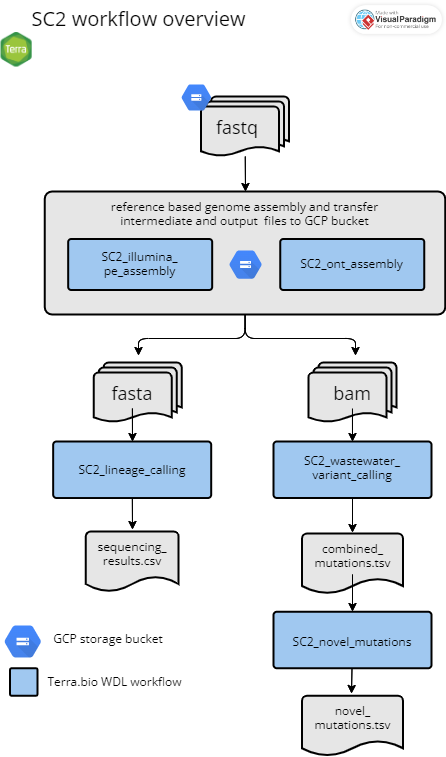

# Overview

**Next generation sequencing and bioinformatic and genomic analysis at CDPHE is not CLIA validated at this time. These workflows and their outputs are not to be used for diagnostic purposes and should only be used for public health action and surveillance purposes. CDPHE is not responsible for the incorrect or inappropriate use of these workflows or their results.**

The following documentation describes the Colorado Department of Public Health and Environment's (CDPHE) workflows for the assembly and analysis of whole genome sequencing data of SARS-CoV-2 on GCP's Terra.bio platform. Workflows are written in WDL and can be imported into a Terra.bio workspace through dockstore.

Our SARS-CoV-2 whole genome reference-based assembly workflows are highly adaptable and facilitate the assembly and analysis of tiled amplicon based sequencing data of SARS-CoV-2. The workflows can accommodate various amplicon primer schemes including Artic V3, Artic V4, Artic V4.1, and Midnight, as well as different sequencing technology platforms including both Illumina and Oxford Nanopore Technology (ONT). Below is a high level overview of our workflows followed by detailed descriptions of each workflow which you can access by clicking the dropdown menus.

Briefly, we begin with one of our processing python scripts (see ''../preprocess_python_scripts'' for more details), which organizes raw fastq files from either Illumina or ONT platforms, pushes the reads to a specified google bucket, and generates an input data table for Terra.bio. Next, using the platform-appropriate assembly workflow on Terra.bio (`SC2_illumina_pe_assembly`, `SC2_illumina_se_assembly`, or `SC2_ont_assembly`), we perform quality control, trimming, and filtering of raw reads, perform reference-guided whole genome assembly, and then transfer intermediate and results files are transferred to a user defined google storage bucket. Next, we use Pangolin and Nextclade to perform clade and lineage assignment on the consensus assemblies and produce a results summary file for the set of sequences analyzed using the `SC2_lineage_calling_and_results` workflow. If you already have a multifasta, you can use the `SC2_multifasta_lineage_calling` workflow for clade and lineage assignment. We generate a nextstrain build using the publicly available [Nextstrain workflow](https://dockstore.org/workflows/github.com/broadinstitute/viral-pipelines/sarscov2_nextstrain:v2.1.33.9?tab=info). For wastewater samples, bam files generated from one of the three assembly workflows can be used as input in our `SC2_wastewater_variant_calling` workflow. Mutation files output from `SC2_wastewater_variant_calling` can be used in `SC2_novel_mutations` for recurrent and novel wastewater mutation tracking. Below is a high level overview of our workflow process that gets us from fastq files to lineage calls.

As of Jan 2023, `SC2_illumina_se_assembly` is no longer maintained. This workflow was developed for the assembly of Illumina 72 bp single-end read data using the Illumina COVIDSEQ library prep protocol. We no longer use this library prep method.

