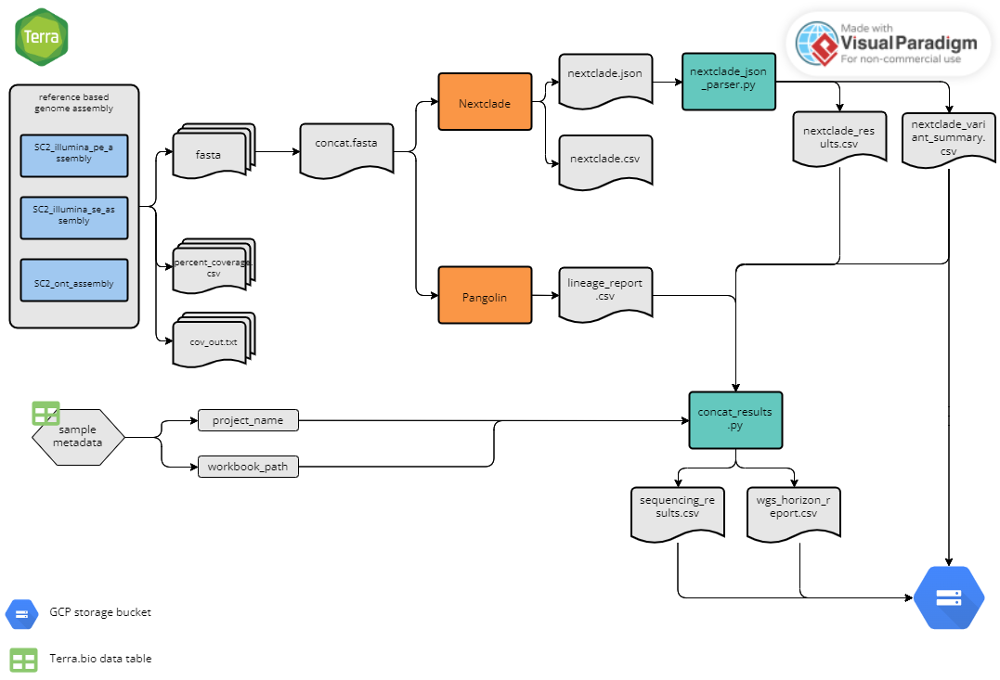

# Results Workflows

The following workflows will perform clade and lineage assignment using Nextclade and Pangolin, respectively. The SC2_lineage_calling_and_results.wdl should be run following assembly with one of the three above reference-based assembly workflows. 

## Lineage Calling and Results Workflow

File: SC2_lineage_calling_and_results.wdl

This workflow should be run following assembly with one of the three reference based assembly workflows. The workflow accepts "sample_set" as the root entity type and uses the data table from any of the three assembly workflows. All three assembly workflows (illumina pe, and ont) are compatible with this workflow. Briefly, the workflow performs the following:

1. concatenates consensus sequences from the sequencing run into a single fasta file
2. runs pangolin on the concatenated fasta file
3. runs nextclade on the concatenated fasta file
4. parses the nextclade json file output using the `nextclade_json_parser.py` script, which pulls out clade and nucleotide and animo acid changes information and converts it to a tabular format.
5. Concatenates sequencing assembly metrics (e.g. percent coverage, assembler version), lineage and clade information, and sequence metadata (e.g. plate name, sample well location) into a single csv file.
6. Generates a csv file with sequencing assembly metrics and lineage information that can be used to parse sequencing data into our LIMS.
7. Transfers intermediate and summary files to a user defined google bucket.  

### Inputs

Below is a summary of the workflow input variables along with the syntax used for the attribute column when setting up the workflow to run on Terra.bio. For the attributes, the "this.sample{terra_data table_name}s." syntax tells Terra to pull the variable from the sample-level terra data table. These variables were either in the original terra data table as inputs for the assembly workflow or added as outputs during the assembly workflow (see reference based assembly workflow inputs and outputs sections for more details). The "workspace." syntax tells Terra to pull the variable from the terra workspace data. Workspace data is described in the `Getting Started` drop down menu above.

| workflow variable                                | attribute (input syntax into workflow)                                |     |
| ------------------------------------------------ | --------------------------------------------------------------------- | --- |
| `concat_seq_results_py`                          | workspace.covid_concat_results_py                                     |     |
| `cov_out`                                        | this.sample{terra_data_table_name}s.cov_out                           |     |
| `nextclade_json_parser_py`                       | workspace.covid_nextclade_json_parser_py                              |     |
| `out_dir_array`                                  | this.sample{terra_data_table_name}s.out_dir                           |     |
| `overwrite`                                      | `true` or `false`                                                     |     |
| `percent_cvg_csv`                                | this.sample{terra_data_table_name}s.percent_cvg_csv                   |     |
| `project_name_array`                             | this.sample{terra_data_table_name}s.project_name                      |     |
| `renamed_consensus`                              | this.sample{terra_data_table_name}s.renamed_consensus                 |     |
| `sample_name`                                    | this.sample{terra_data_table_name}s.sample{terra_data_table_name}\_id |     |
| `terra_data_table_path_array`                    | this.sample{terra_data_table_name}s.terra_data_table_path             |     |
| `version_capture_lineage_calling_and_results_py` | workspace.covid_version_capture_lineage_calling_and_results_py        |     | 

### Outputs

This workflow generates several output files that are transferred to the user defined user google bucket defined by this.sample{terra_data_table_name}s.out_dir. The table below details each output.  For more details regarding the values in each column, see either the software readmes or the readme for the specific python script listed in the description.

| output variable name                          | file_name                                                               | description                                    | google bucket path                                |
| --------------------------------------------- | ----------------------------------------------------------------------- | ---------------------------------------------- | ------------------------------------------------- |
| `cat_fastas`                                  | `concatenate_assemblies.fasta`                                          | all consensus sequences from assembly in a single fasta file  | `gs://{user_defined_gcp_bucket}/multifasta/`|
| `nextclade_clades_csv`                        | `{seq_run}_nextclade_results.csv`                                       | csv file generated from the `nextclade_json_parser.py` script detailing the clade for each sequence | `gs://{user_defined_gcp_bucket}/nextclade_out/`   |
| `nextclade_csv`                               | `nextclade.csv`                                                         | csv file generated from nextclade              | `gs://{user_defined_gcp_bucket}/nextclade_out/`   |
| `nextclade_json`                              | `nextclade.json`                                                        | json file generated from nextclade; this json file is parsed using the `nextclade_json_parser.py` script and key info is pulled out and converted into a tabular format in the `nextclade_clades_csv`, `nextclade_variants_csv` and `sequencing_results.csv` files (see the readme for the `nextclade_json_parser.py` script for more details)                                                                     | `gs://{user_defined_gcp_bucket}/nextclade_out/`   |
| `nextclade_variants_csv`                      | `{seq_run}_nextclade_variant_summary.csv`                               | csv file generated from the `nextclade_json_parser.py` script detailing the nucleotide and amino acid changes for each sequence | `gs://{user_defined_gcp_bucket}/summary_results/` |
| `nextclade_version`                           | N/A                                                                     | version of nextclade                           | N/A                                               |
| `pangolin_lineage`                            | `pangolin_lineage_report.csv`                                           | lineage report generated from pangolin         | `gs://{user_defined_gcp_bucket}/pangolin/`        |
| `pangolin_version`                            | N/A                                                                     | version of pangolin                            | N/A                                               |
| `sequencing_results_csv`                      | `{seq_run}_sequencing_results.csv`                                      | summary of the sequencing metrics and lineage/clade assignments for each sequence generated from the `concat_seq_metrics_and_lineage_results.py` script. See the script's readme for more details. | `gs://{user_defined_gcp_bucket}/summary_results/` |
| `transfer_date_lineage_calling`               | N/A                                                                     | date transfer task was run                     | N/A                                               |
| `version_capture_lineage_calling_and_results` | `version_capture_{workflow_name}_{project_name}_{workflow_version}.csv` | version capture CSV file                       | `gs://{user_defined_gcp_bucket}/summary_results/` |

## Multifasta Lineage Calling and Results Workflow

This workflow has been removed. The workflow and its documentation can still be accessed from the v2.4.1 release.