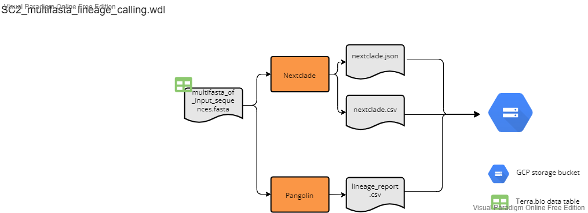

# Results Workflows

The following workflows will perform clade and lineage assignment using Nextclade and Pangolin, respectively. The SC2_lineage_calling_and_results.wdl should be run following assembly with one of the three above reference-based assembly workflows. The SC2_mulitfasta_lineage_calling can be run on any multifasta file and is not dependent on any of the above workflows.  

## Lineage Calling and Results Workflow

File: SC2_lineage_calling_and_results.wdl

This workflow should be run following assembly with one of the three reference based assembly workflows. The workflow accepts "sample_set" as the root entity type and uses the data table from any of the three assembly workflows. All three assembly workflows (illumina pe, illumina se, and ont) are compatible with this workflow. Breifly the workflow performs the following:

1. concatenates consensus sequences from the sequencing run into a single fasta file
2. runs panoglin on the concatenated fasta file
3. runs nextclade on the concatenated fasta file
4. parses the nextclade json file output using the `nextclade_json_parser.py` script which pulls out clade and nucleotide and animo acid changes information and converts it to a tabular format.
5. Concaenates sequencing assembly metrics (e.g. percent coverage, assembler version), lineage and clade information, and sequence metadata (e.g. plate name, sample well location) into a single csv file.
6. Generates a csv file with sequencing assembly metrics and lineage information that can be used to parse sequencing data into our LIMS.
7. Transfers intermediate and summary files to a user defined google bucket.  

### Inputs

Below is a summary of the workflow input variables along with the syntax used for the attribute column when setting up the workflow to run on Terra.bio. For the attributes, the "this.sample{terra_datatable_name}s." syntax refers Terra to pull the variable from the terra datatable as used for sample sets. These variables were either in the original terra datatable as inputs for the assembly workflow (see referece based assembly workflow inputs sections above for more details) or added as outputs during the assemlby workflow (see reference based assembly workflow outputs sections for more details). The "workspace." syntax refers Terra to pull the variable from the terra workspace data. Workspace data is describe in the `Getting Started` drop down menu above.

| workflow variable          | attribute (input syntax into workflow)                              |     |
| -------------------------- | ------------------------------------------------------------------- | --- |
| `assembler_version_array`  | this.sample{terra_datatable_name}s.assembler_version                |     |
| `concat_seq_results_py`    | workspace.covid_concat_results_py                                   |     |
| `cov_out`                  | this.sample{terra_datatable_name}s.cov_out                          |     |
| `nextclade_json_parser_py` | workspace.covid_nextclade_json_parser_py                            |     |
| `out_dir_array`            | this.sample{terra_datatable_name}s.out_dir                          |     |
| `percent_cvg_csv`          | this.sample{terra_datatable_name}s.percent_cvg_csv                  |     |
| `project_name_array`       | this.sample{terra_datatable_name}s.project_name                     |     |
| `renamed_consensus`        | this.sample{terra_datatable_name}s.renamed_consesnus                |     |
| `sample_name`              | this.sample{terra_datatable_name}s.sample{terra_datatable_name}\_id |     |
| `workbook_path_array`      | this.sample{terra_datatable_name}s.workbook_path                    |     |

### Outputs

This workflow generates several output files which are transfered to the user defined user google bucket as defined by this.sample{terra_datatable_name}s.out_dir. The table below details each output. For more detailed regarding the values in each column for the outputs see either the software readmes or the readme for the specific python script as listed in the description.

| output variable name     | file_name                                 | description                                                                                                                                                                                                                                                                                                                                     | google bucket path                                |
| ------------------------ | ----------------------------------------- | ----------------------------------------------------------------------------------------------------------------------------------------------------------------------------------------------------------------------------------------------------------------------------------------------------------------------------------------------- | ------------------------------------------------- |
| `cat_fastas`             | `concatenate_assemblies.fasta`            | all consesnus sequences from assembly in a single fasta file                                                                                                                                                                                                                                                                                    | `gs://{user_defined_gcp_bucket}/multifasta/`      |
| `nextclade_clades_csv`   | `{seq_run}_nextclade_results.csv`         | csv file generated from the `nextclade_json_parser.py` script detailing the clade for each seqeunce                                                                                                                                                                                                                                             | `gs://{user_defined_gcp_bucket}/nextclade_out/`   |
| `nextclade_csv`          | `nextclade.csv`                           | csv file generated from nextclade                                                                                                                                                                                                                                                                                                               | `gs://{user_defined_gcp_bucket}/nextclade_out/`   |
| `nextclade_json`         | `nextclade.json`                          | json file generated from nextclade; this json file is parsed using the `nextclade_json_parser.py` script and key info is pulled out and converted into a tablular format in the `nextclade_clades_csv`, `nextclade_variants_csv` and `sequencing_results.csv` files (see the readme for the `nextclade_json_parser.py` script for more details) | `gs://{user_defined_gcp_bucket}/nextclade_out/`   |
| `nextclade_variants_csv` | `{seq_run}_nextclade_variant_summary.csv` | csv file generated from the `nextclade_json_parser.py` script detailing the nucleotide and amino acid changes for each seqeunce                                                                                                                                                                                                                 | `gs://{user_defined_gcp_bucket}/summary_results/` |
| `nextclade_version`      | N/A                                       | version of nextclade                                                                                                                                                                                                                                                                                                                            | N/A                                               |
| `pangolin_lineage`       | `pangolin_lineage_report.csv`             | lineage report generated from pangolin                                                                                                                                                                                                                                                                                                          | `gs://{user_defined_gcp_bucket}/pangolin/`        |
| `pangolin_version`       | N/A                                       | version of panoglin                                                                                                                                                                                                                                                                                                                             | N/A                                               |
| `sequencing_results_csv` | `{seq_run}_sequencing_results.csv`        | summary of the sequencing metrics and lineage/clade assignments for each sequence generated from the `concat_seq_metrics_and_lineage_results.py` script. see the `concat_seq_metrics_and_lineage_results.py` readme for more details.                                                                                                           | `gs://{user_defined_gcp_bucket}/summary_results/` |
| `wgs_horizon_report_csv` | `{seq_run}_wgs_horizon_report.csv`        | results csv used for parsing results into our LIMS. This file is generated from the `concat_seq_metrics_and_lineage_results.py` script. see the `concat_seq_metrics_and_lineage_results.py` readme for more details.                                                                                                                            | `gs://{user_defined_gcp_bucket}/summary_results/` |

## Multifasta Lineage Calling and Results Workflow

File: SC2_multifasta_lineage_calling.wdl

This workflow will perfrom lineage and clade assignment using a concatenated fasta file as input. This workflow is a stand alone workflow and does not depend on any of the previous reference-based assembly workflows. The workflow accepts "sample" as the root entity type and uses a simple two column data table (see inputs below).

Brienfly this workflow will perform the following:

1. Run nextclade
2. Run panoglin
3. transfer outputs to a user defined google bucket.

### Inputs

1. Terra datatable. You will need to create a terra data that contains the following two columns:
    1. `entity:samle_id` : should contain the prefix that you would like for you output files
    2. `multifasta`: google bucket path to the multi-sequence fasta file

Below is a summary of the workflow input variables along with the syntax used for the attribute column when setting up the workflow to run on Terra.bio. For the attributes, the "this." syntax refers Terra to pull the variable from the terra datatable (#1 above).

| workflow variable | attribute (input syntax into workflow)      |
| ----------------- | ------------------------------------------- |
| `multifasta`      | this.multifasta                             |
| `sample_id`       | this.sample{terra_datatable_name}\_id       |
| `out_dir`         | "gs://{path to user defined google bucket}" |

### Outputs

This workflow generates several output files which are transfered to the user defined user google bucket as defined by the `out_dir` variable. The table below details each output.

| output variable name | file_name                                 | description                                | google bucket path                             |
| -------------------- | ----------------------------------------- | ------------------------------------------ | ---------------------------------------------- |
| `nextclade_version`  | N/A                                       | nextclade version                          | N/A                                            |
| `nextclade_json`     | `{sample_id}_nextclade_json`              | json file generated from nextclade         | `gs://{user_defined_gcp_bucket}/nextclade_out` |
| `auspice_json`       | `{sample_id}_nextclade.auspice.json`      | auspice json file generated from nextclade | `gs://{user_defined_gcp_bucket}/nextclade_out` |
| `nextclade_csv`      | `{sample_id}_nextclade.csv`               | csv file generated from nextclade          | `gs://{user_defined_gcp_bucket}/nextclade_out` |
| `pangolin_version`   | N/A                                       | pangolin version                           | N/A                                            |
| `pangolin_lineage`   | `{sample_id}_panoglin_lineage_report.csv` | lineage report generated from pangolin     | `gs://{user_defined_gcp_bucket}/pangolin_out`  |
