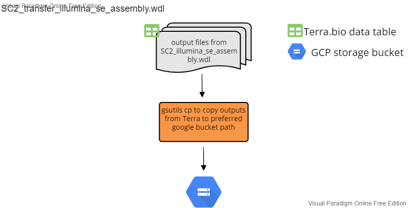

# Transfer Workflows

After assembly, the assembly workflow outputs are transferred from Terra back to a user-specified google bucket for additional analysis and storage. Each workflow accepts "sample" as the root entity type and uses the data table from the corresponding assembly workflow data table. 

## Illumina PE

File: SC2_transfer_illumina_pe_assembly.wdl

This workflow transfers the output file generated from SC2_illumina_pe_assembly to a user specified google bucket. Below is a summary of the workflow input variables along with the syntax used for the attribute column when setting up the workflow to run on Terra.bio. For the attributes, the "this." syntax tells Terra to pull the variable from the sample-level terra data table. The Google Bucket path describes where in the user google bucket the output file is transferred to.  

| workflow variable    | attribute (input syntax into workflow) | google bucket path                           |
| -------------------- | -------------------------------------- | -------------------------------------------- |
| `consensus`          | this.consensus                         | `gs://{user_defined_gcp_bucket}/assemblies/` |
| `covhist_out`        | this.coverage_hist                     | `gs://{user_defined_gcp_bucket}/bam_stats/`  |
| `cov_out`            | this.coverage_out                      | `gs://{user_defined_gcp_bucket}/bam_stats/`  |
| `fastqc_clean1_html` | this.fastq_clean1_html                 | `gs://{user_defined_gcp_bucket}/fastqc/`     |
| `fastqc_clean1_zip`  | this.fastqc_clean1_zip                 | `gs://{user_defined_gcp_bucket}/fastqc/`     |
| `fastqc_clean2_html` | this.fastqc_clean2_html                | `gs://{user_defined_gcp_bucket}/fastqc/`     |
| `fastqc_clean2_zip`  | this.fastqc_clean2_zip                 | `gs://{user_defined_gcp_bucket}/fastqc/`     |
| `filtered_reads_1`   | this.filtered_reads_1                  | `gs://{user_defined_gcp_bucket}/seqyclean/`  |
| `filtered_reads_2`   | this.filtered_reads_2                  | `gs://{user_defined_gcp_bucket}/seqyclean/`   |
| `flagstat_out`       | this.flagstat_out                      | `gs://{user_defined_gcp_bucket}/bamstats/`   |
| `out_dir`            | this.out_dir                           | N/A                                          |
| `renamed_consensus`  | this.renamed_consensus                 | `gs://{user_defined_gcp_bucket}/assemblies/` |
| `trimsort_bam`       | this.trimsort_bam                      | `gs://{user_defined_gcp_bucket}/alignments/` |
| `trimsort_bamindex`  | this.trimsort_bamindex                 | `gs://{user_defined_gcp_bucket}/alignments/` |
| `variants`           | this.variants                          | `gs://{user_defined_gcp_bucket}/variants/`   |

## Illumina SE

**This workflow is not longer maintained.**

File: SC2_transfer_illumina_se_assembly.wdl

This workflow transfers the output file generated from SC2_illumina_se_assembly to a user specified google bucket. Below is a summary of the workflow input variables along with the syntax used for the attribute column when setting up the workflow to run on Terra.bio. For the attributes, the "this." syntax tells Terra to pull the variable from the sample-level terra data table. The Google Bucket path describes where in the user google bucket the output file is transferred to.  

| workflow variable   | attribute (input syntax into workflow)               | google bucket path                               |
| ------------------- | ---------------------------------------------------- | ------------------------------------------------ |
| `adapter_stats`     | this.sample{terra_data_table_name}s.adapter_stats     | `gs://{user_defined_gcp_bucket}/filter_reads/`   |
| `consensus`         | this.sample{terra_data_table_name}s.consensus         | `gs://{user_defined_gcp_bucket}/assemblies/`     |
| `covhist_out`       | this.sample{terra_data_table_name}s.coverage_hist     | `gs://{user_defined_gcp_bucket}/bam_stats/`      |
| `cov_out`           | this.sample{terra_data_table_name}s.coverage_out      | `gs://{user_defined_gcp_bucket}/bam_stats/`      |
| `fastqc_clean_html` | this.sample{terra_data_table_name}s.fastq_clean_html  | `gs://{user_defined_gcp_bucket}/fastqc/`         |
| `fastqc_clean_zip`  | this.sample{terra_data_table_name}s.fastqc_clean_zip  | `gs://{user_defined_gcp_bucket}/fastqc/`         |
| `filtered_reads`    | this.sample{terra_data_table_name}s.filtered_reads    | `gs://{user_defined_gcp_bucket}/seqyclean/`      |
| `flagstat_out`      | this.sample{terra_data_table_name}s.flagstat_out      | `gs://{user_defined_gcp_bucket}/bamstats/`       |
| `out_dir`           | this.sample{terra_data_table_name}s.out_dir           | N/A                                              |
| `PhiX_stats`        | this.sample{terra_data_table_name}s.PhiX_stats        | `gs://{user_defined_gcp_bucket}/filtered_reads/` |
| `renamed_consensus` | this.sample{terra_data_table_name}s.renamed_consensus | `gs://{user_defined_gcp_bucket}/assemblies/`     |
| `trimsort_bam`      | this.sample{terra_data_table_name}s.trimsort_bam      | `gs://{user_defined_gcp_bucket}/alignments/`     |
| `trimsort_bamindex` | this.sample{terra_data_table_name}s.trimsort_bamindex | `gs://{user_defined_gcp_bucket}/alignments/`     |
| `variants`          | this.sample{terra_data_table_name}s.variants          | `gs://{user_defined_gcp_bucket}/variants/`       |

## Oxford Nanopore Technologies (ONT)

File: SC2_transfer_ont_assembly.wdl

This workflow transfers the output file generated from SC2_ont_assembly to a user specified google bucket. Below is a summary of the workflow input variables along with the syntax used for the attribute column when setting up the workflow to run on Terra.bio. For the attributes, the "this." syntax tells Terra to pull the variable from the sample-level terra data table. The Google Bucket path describes where in the user google bucket the output file is transferred to.  

| workflow variable    | attribute (input syntax into workflow) | google bucket path when transferred               |
| -------------------- | -------------------------------------- | ------------------------------------------------ |
| `covhist_out`        | this.coverage_hist                     | `gs://{user_defined_gcp_bucket}/bam_stats/`      |
| `cov_out`            | this.coverage_out                      | `gs://{user_defined_gcp_bucket}/bam_stats/`      |
| `filtered_fastq`     | this.filtered_fastq                    | `gs://{user_defined_gcp_bucket}/filtered_fastq/` |
| `flagstat_out`       | this.flagstat_out                      | `gs://{user_defined_gcp_bucket}/bamstats/`       |
| `out_dir`            | this.out_dir                           | N/A                                              |
| `renamed_consensus`  | this.renamed_consensus                 | `gs://{user_defined_gcp_bucket}/assemblies/`     |
| `bamstats_out`       | this.bamstats_out                      | `gs://{user_defined_gcp_bucket}/bam_stats/`      |
| `scaffold_consensus` | this.scaffold_consensus                | `gs://{user_defined_gcp_bucket}/assemblies/`     |
| `trimsort_bam`       | this.trimsort_bam                      | `gs://{user_defined_gcp_bucket}/alignments/`     |
| `variants`           | this.variants                          | `gs://{user_defined_gcp_bucket}/variants/`       |

