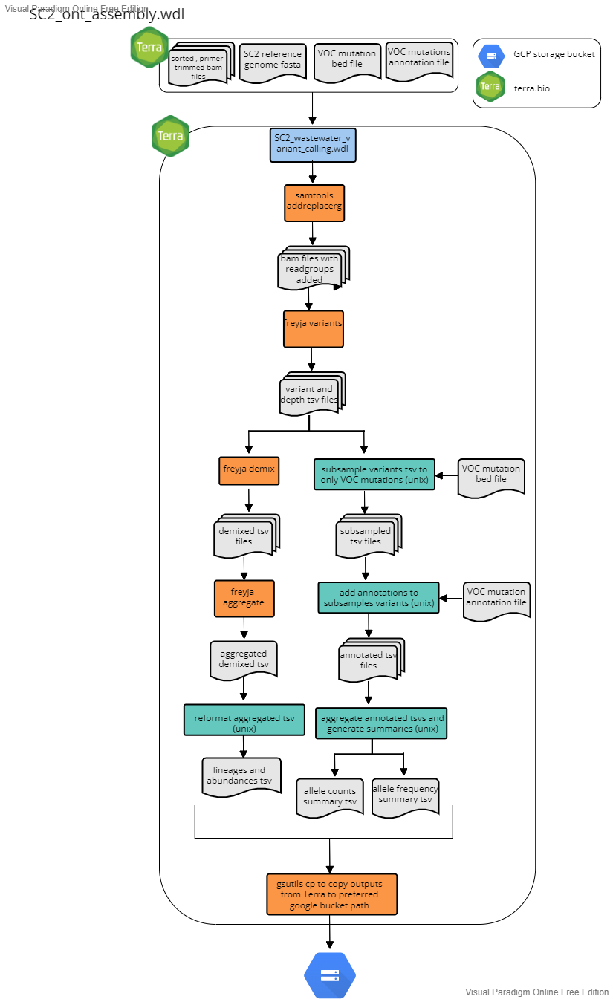

# Wastewater Workflow

**This workflow is undergoing updates.**

For wastewater samples, use one of the assembly workflows above to generate coordinate sorted and primer trimmed bam files. Then see below for how we use [freyja](https://github.com/andersen-lab/Freyja) for performing variant calling, lineage demixing to generate summary files for wastewater whole genome sequencing of SARS-CoV-2, as well as custom code to summarize VOC-associated constellations of mutations.

The workflow accepts "sample_set" as the root entity type and uses the data table from any of the three assembly workflows. All three assembly workflows (illumina pe, illumina se and ont) are compatible with this workflow.

Briefly the workflow performs the following:

1. Add read groups to the bam files using samtools
2. Use Freya variants to perform variant calling using freya and generate a depths filter_reads
3. Run Freya demix to perform lineage deconvolution and to estimate lineage abundances
4. Pull out a set of curated VOC-associated mutations from the variants file generated by Freya
5. Generate a summary of constellations of VOC-associated mutations
6. transfer the outputs to a user-defined google bucket

## Inputs

Below is a summary of the workflow input variables along with the syntax used for the attribute column when setting up the workflow to run on Terra.bio. For the attributes, the ""this.sample{terra_datatable_name}s." syntax refers Terra to pull the variable from the terra datatable as used for sample sets. These variables were either in the original terra datatable as inputs for the assembly workflow (see referece based assembly workflow inputs sections above for more details) or added as outputs during the assemlby workflow (see reference based assembly workflow outputs sections for more details). The  "workspace." syntax refers Terra to pull the variable from the terra workspace data. Workspace data is describe in the `Getting Started` drop down menu above.

| workflow variable | attribute (input syntax into workflow)                                                                                                                                        |
| ----------------- | ----------------------------------------------------------------------------------------------------------------------------------------------------------------------------- |
| `covid_genome`    | workspace.covid_genome                                                                                                                                                        |
| `out_dir`         | 'gs://covid_terra/{seq_run}/terra_outputs' (must be written as a string in quotes-- we have not updated the workflow to accept the out_dir column from the terra datatable) |
| `sample_id`       | this.sample{terra_datatable_name}s.sample{terra_datatable_name}\_id                                                                                                           |
| `trimsort_bam`    | this.sample{terra_datatable_name}s.trimsort_bam                                                                                                                               |
| `voc_annotations` | workspace.voc_annotations                                                                                                                                                     |
| `voc_bed`         | workspace.voc_bed                                                                                                                                                             |

## Outputs

This workflow generates several output files which are transfered to the user defined google bucket as defined by a string (e.g. "gs://covid_terra/NEXSEQ_101/terra_outputs"). The table below details each output. For more details regarding the values in each column for the outputs see either the software readmes or the readme for the specific python script as listed in the description.

| output variable name     | file_name                                    | description                                            | google bucket path                                                            |     |
| ------------------------ | -------------------------------------------- | ------------------------------------------------------ | ----------------------------------------------------------------------------- | --- |
| `addrg_bam`              | `{sample_name}_addRG.bam`                    | ???                                                    | N/A                                                                           |     |
| `variants`               | `{smaple_name}_variants.tsv`                 | generated for each sample; output from freyja demix    | `gs://{user_defined_gcp_bucket}/waste_water_variant_calling/freyja/`          |     |
| `depth`                  | `{sample_name}_depth.tsv`                    | generated for each sample; output from freyja variants | `gs://{user_defined_gcp_bucket}/waste_water_variant_calling/freyja/`          |     |
| `demix`                  | `{sample_name}_demixed.tsv`                  | generated for each sample; output from freyja demix    | `gs://{user_defined_gcp_bucket}/waste_water_variant_calling/freyja/`          |     |
| `fill_NA_tsv`            | `{sample_name}_voc_fill_NA.tsv`              |                                                        | N/A                                                                           |     |
| `reformatted_tsv`        | `{sample_name}_voc_reformat.tsv`             | generated for each sample                              | N/A                                                                           |     |
| `sample_voc_tsv_summary` | `{sample_name}_voc_mutations_forsummary.tsv` | generated for each sample                              | `gs://{user_defined_gcp_bucket}/waste_water_variant_calling/sample_variants/` |     |
| `sample_voc_tsv_counts`  | `{sample_name}_voc_mutations_counts.tsv`     | generated for each sample                              | `gs://{user_defined_gcp_bucket}/waste_water_variant_calling/sample_variants/` |     |
| `demix_reformatted`      | `{sample_id}_demixed_reformatted.tsv`        | generated for each sample                              | N/A                                                                           |     |
| `voc_summary_temp`       | `voc_mutations_summary_temp.tsv`             |                                                        | N/A                                                                           |     |
| `voc_counts`             | `voc_mutations_counts.tsv`                   |                                                        | `gs://{user_defined_gcp_bucket}/waste_water_variant_calling/`                 |     |
| `voc_summary`            | `voc_mutations_summary.tsv`                  |                                                        | `gs://{user_defined_gcp_bucket}/waste_water_variant_calling/`                 |     |
| `demix_summary`          | `lineage_abundances.tsv`                     |                                                        | `gs://{user_defined_gcp_bucket}/waste_water_variant_calling/`                 |     |
| `transfer_date`          | N/A                                          | date the workflow was run                              | N/A                                                                           |     |
