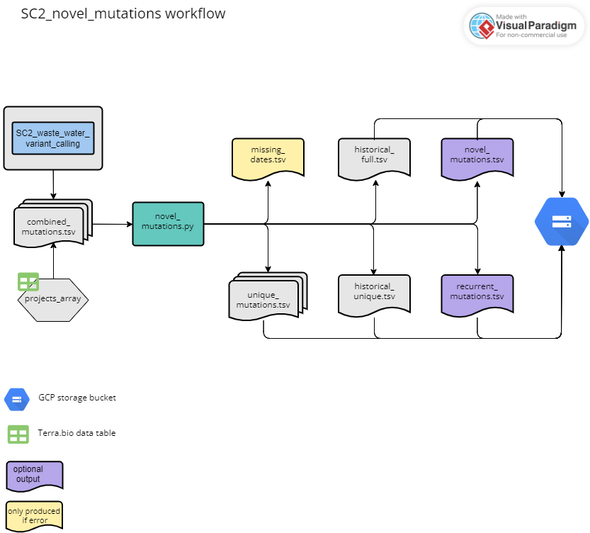

# Wastewater Workflow

**This workflow is undergoing updates.**

For wastewater samples, use one of the assembly workflows above to generate coordinate sorted and primer trimmed bam files. Then see below for how we use [freyja](https://github.com/andersen-lab/Freyja) for performing variant calling, lineage demixing to generate summary files for wastewater whole genome sequencing of SARS-CoV-2, as well as custom code to summarize VOC-associated constellations of mutations in `SC2_waste_water_variant_calling`. We then use the mutation outputs along with custom code for recurrent and novel wastewater mutation tracking in `SC2_novel_mutations`.

## SC2_waste_water_variant_calling

The workflow accepts "sample_set" as the root entity type and uses the data table from either of the assembly workflows. Both assembly workflows (illumina pe and ont) are compatible with this workflow.

Briefly, the workflow performs the following:

1. Add read groups to the bam files using samtools
2. Use freyja variants to perform variant calling using freyja and generate a depths filter_reads
3. Run freyja demix to perform lineage de-convolution and to estimate lineage abundances
4. Pull out a set of curated VOC-associated mutations from the variants file generated by freyja
5. Generate a summary of constellations of VOC-associated mutations
6. Transfer the outputs to a user-defined google bucket

### Inputs

Below is a summary of the workflow input variables along with the syntax used for the attribute column when setting up the workflow to run on Terra.bio. For the attributes, the "this.sample{terra_data table_name}s." syntax tells Terra to pull the variable from the sample-level terra data table. These variables were either in the original terra data table as inputs for the assembly workflow or added as outputs during the assembly workflow (see reference based assembly workflow inputs and outputs sections for more details). The "workspace." syntax tells Terra to pull the variable from the terra workspace data. Workspace data is described in the `Getting Started` drop down menu above.

| workflow variable                        | attribute (input syntax into workflow)                                |
| ---------------------------------------- | --------------------------------------------------------------------- |
| `covid_genome`                           | workspace.covid_genome                                                |
| `covid_gff`                              | workspace.covid_genome_gff                                            |
| `out_dir_array`                          | this.{terra_data_table_names}s.out_dir                                |
| `overwrite`                              | `true` or `false`                                                     |
| `project_name_array`                     | `this.{terra_data_table_name}s.project_name                           |
| `sample_name`                            | this.{terra_data_table_name}s.{terra_data_table_name}_id              |
| `trimsort_bam`                           | this.{terra_data_table_name}s.trimsort_bam                            |
| `version_capture_wwt_variant_calling_py` | workspace.covid_version_capture_wastewater_variant_calling_py         |

### Outputs

This workflow generates several output files which are transferred to the user defined google bucket as defined by a string (e.g. "gs://covid_terra/NEXSEQ_101/terra_outputs"). The table below details each output. For more details regarding the values in each column, see either the software readmes or the readme for the specific python script listed in the description.

| output variable name                  | file_name                                                               | description                                            | google bucket path                                                            |
| ------------------------------------- | ----------------------------------------------------------------------- | ------------------------------------------------------ | ----------------------------------------------------------------------------- |
| `addrg_bam`                           | `{sample_name}_addRG.bam`                                               | ???                                                    | N/A                                                                           |
| `combined_mutations_tsv`              | `combined_mutations.tsv`                                                | mutation counts for all samples                        | `gs://{user_defined_gcp_bucket}/waste_water_variant_calling/`                 |
| `variants`                            | `{sample_name}_variants.tsv`                                            | generated for each sample; output from freyja demix    | `gs://{user_defined_gcp_bucket}/waste_water_variant_calling/freyja/`          |
| `depth`                               | `{sample_name}_depth.tsv`                                               | generated for each sample; output from freyja variants | `gs://{user_defined_gcp_bucket}/waste_water_variant_calling/freyja/`          |
| `demix`                               | `{sample_name}_demixed.tsv`                                             | generated for each sample; output from freyja demix    | `gs://{user_defined_gcp_bucket}/waste_water_variant_calling/freyja/`          |
| `demix_aggregated`                    | `demix_aggregated.tsv`                                                  |                                                        | `gs://{user_defined_gcp_bucket}/waste_water_variant_calling/`                 |
| `transfer_date_wwt_variant_calling`   | N/A                                                                     | date the workflow was run                              | N/A                                                                           |
| `version_capture_wwt_variant_calling` | `version_capture_{workflow_name}_{project_name}_{workflow_version}.csv` | software versions used in analysis                     | `gs://{user_defined_gcp_bucket}/summary_results/`                             |

## SC2_novel_mutations

The workflow accepts "set" as the root entity type and uses a new terra data table, described below.

Briefly, the workflow performs the following:

1. Call the custom python script `novel_mutations.py` to create the following files:
    - For each project, if any samples are missing collection dates in the metadata file, create a file of missing dates. Error out if created.
    - For each project, create a unique mutation file. 
    - Append new mutations to historical_full file and outputs. 
    - Recalculates date-related columns for historical_unique file, appends any new mutations, and outputs. 
    - Check for recurrent (not seen in > 6 months) and novel mutations and output files if any found.
2. Scatter to transfer each project's unique mutation file to the user defined google bucket.
3. If recurrent or novel mutations files created, transfer to the user defined google bucket.
4. Transfer the new historical_full and historical_unique files to the user defined google bucket. **This will overwrite both historical files, so object versioning is highly recommended.**

### Inputs

#### Terra data table

The terra data table must include the following columns listed below. 

| column header         | description                                                                                          |
| --------------------- | ---------------------------------------------------------------------------------------------------- |
| `entity:project_name` | column with a list of project names. (e.g. `entity:covwwt_2023-12-12_id`)                            |
| `combined_mutations`  | column with a list of paths to combined mutations files generated in SC2_waste_water_variant_calling |

#### Workflow inputs

| workflow variable           | attribute (input syntax into workflow)                                |
| --------------------------- | --------------------------------------------------------------------- |
| `project_names_array`       | this.{terra_data_table_name}s.{terra_data_table_name}_id              |
| `combined_mutations_array`  | this.{terra_data_table_name}s.combined_mutations                      |
| `covwwt_path`               | "gs://bucket/folder"                                                  |
| `gff_mutations`             | workspace.novel_mutations_gff                                         |
| `historical_data_path`      | "gs://bucket/folder"                                                  |
| `historical_full`           | workspace.novel_mutations_historical_full                             |
| `historical_unique`         | workspace.novel_mutations_historical_unique                           |
| `metadata`                  | workspace.wwt_metadata                                                |
| `novel_mutations_append_py` | workspace.novel_mutations_append_py                                   |
| `sites_to_drop`             | this.sites_to_drop                                                    |
| `today`                     | "yyyy-mm-dd" (fill in today's date with this format)                  |
| `overwrite_project_and_set` | `true` or `false` (should typically be set to `false`)                | 
| `overwrite_historical`      | `true` or `false` (should typically be set to `true`)                 |

### Outputs

This workflow generates several output files which are transferred to the user defined google bucket. The table below details each output. For more details, see either the software readmes or the readme for the novel_mutations.py python script.

| output variable name                | file_name                               | description                                            | google bucket path                                              |
| ----------------------------------- | --------------------------------------- | ------------------------------------------------------ | --------------------------------------------------------------- |
| `{project_name}_missing_dates`      | `{project_name}_missing_dates.tsv`      | generated if any samples are missing a collection date | N/A                                                             |
| `{project_name}_unique_mutations`   | `{project_name}_unique_mutations.tsv`   | generated for each project                             | `gs://{user_defined_gcp_bucket}/{project_name}/novel_mutations/`|
| `novel_mutations_historical_full`   | `novel_mutations_historical_full.tsv`   | generated for entire set                               | `gs://{user_defined_gcp_bucket}/`                               |
| `novel_mutations_historical_unique` | `novel_mutations_historical_unique.tsv` | generated for entire set                               | `gs://{user_defined_gcp_bucket}/`                               |
| `novel_mutations_{today}`           | `novel_mutations_{today}.tsv`           | generated for entire set                               | `gs://{user_defined_gcp_bucket}/novel_mutations/`               |
| `recurrent_mutations_{today}`       | `recurrent_mutations_{today}.tsv`       | generated for entire set                               | `gs://{user_defined_gcp_bucket}/novel_mutations/`               |
| `transfer_date_novel_mutations`     | N/A                                     | date transfer task was run                             | N/A                                                             |
