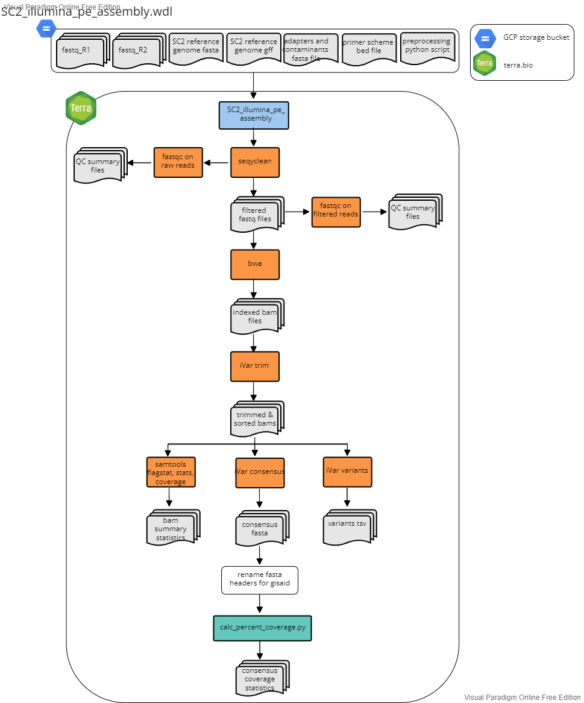
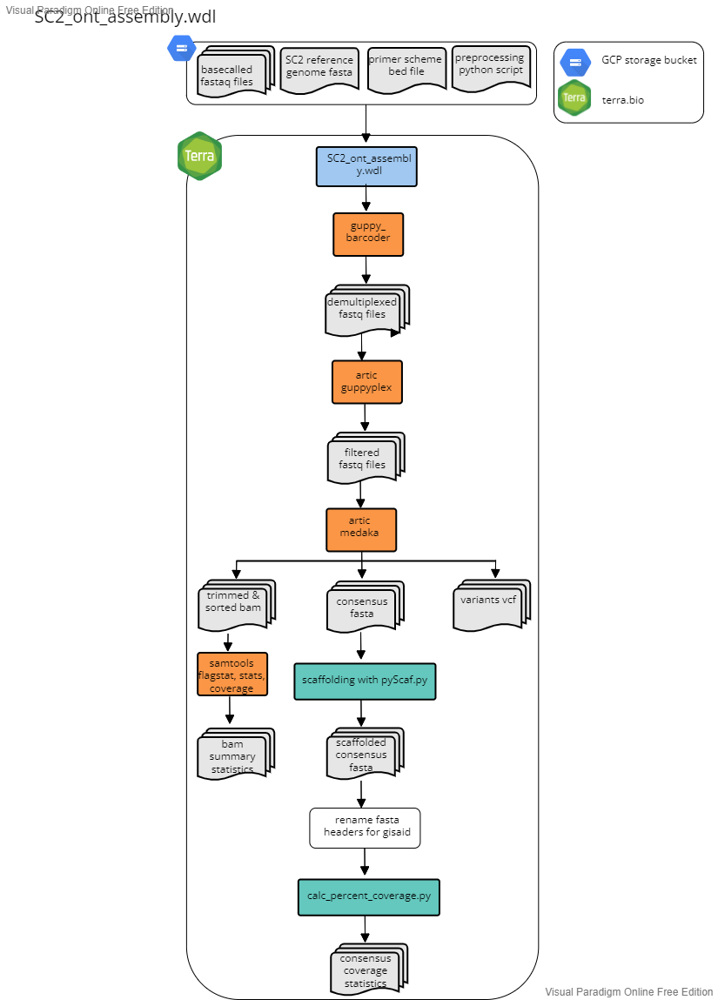
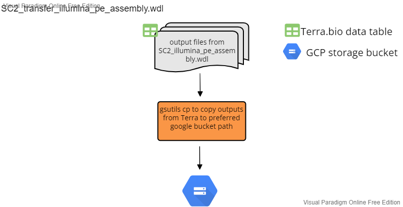
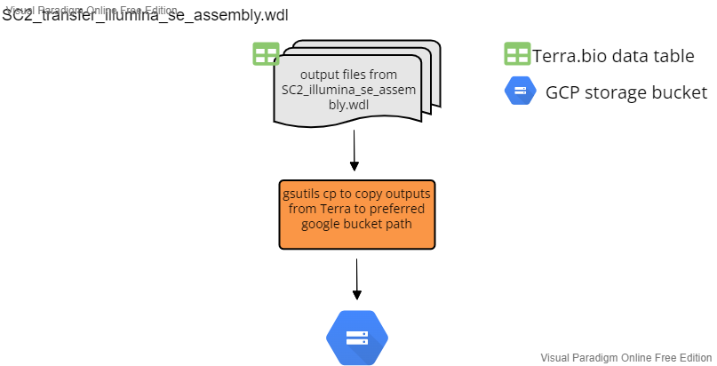
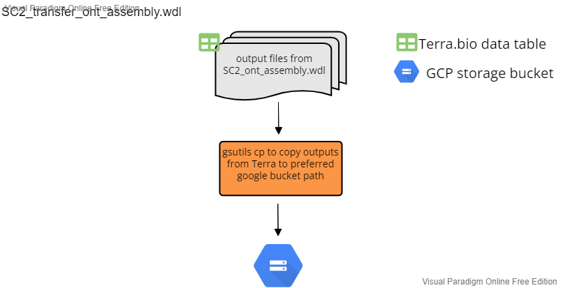
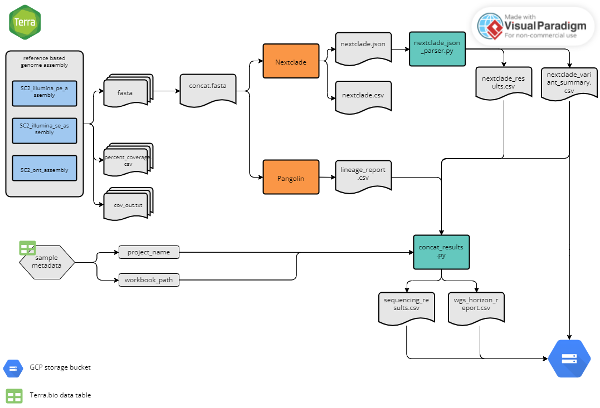
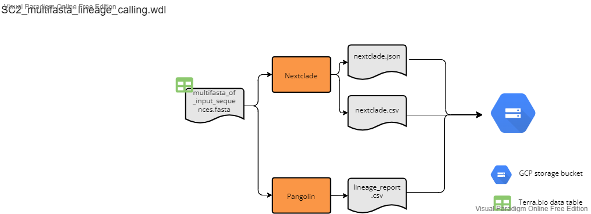

# CDPHE_SARS-CoV-2 Workflows

## Overview

The following documentation describes the Colorado Department of Public Health and Environments's workflows for the assembly and analysis of whole genome sequencing data of SARS-CoV-2 on GCP's Terra.bio platform. Workflows are written in WDL and can be imported into a Terra.bio workspace through dockstore.

Our SARS-CoV-2 whole genome reference-based assembly workflows are highly adaptable and facilitate the assembly and analysis of tiled amplicon based sequencing data of SARS-CoV-2. The workflows can accomodate various amplicon primer schemes including Artic V3, Artic V4, Artic V4.1 and Midnight, as well as diffent sequencing technology platforms including both Illumina and Oxford Nanopore Technology (ONT). Below is a high level overview of our workflows followed by detailed descriptions of each workflow which you can access by clicking the dropdown menus.

Briefly, we begin with one of our processing python scripts (see ''../preprocess_python_scripts'' for more details), which organizes raw fastq files from either Illumina or ONT platforms, pushes the reads to a specified google bucket, and generates an input data table for Terra.bio. Next, using the platform appropriate assembly workflow on Terra.bio (``SC2_illumina_pe_assembly``, ``SC2_illumina_se_assembly``, or ``SC2_ont_assembly``), we perform quality control, trimming, and filtering of raw reads, and perform reference-guided whole genome assembly. Following assembly, intermediate and results files are transfered to a user defined google storage bucket using the appropriate transfer workflow (``SC2_transfer_illumina_pe_assembly``, ``SC2_transfer_illumina_se_assembly``, or ``SC2_transfer_ont_assembly``). Next, we use Pangolin and Nextclade to peform clade and lineage assignment on the consesnus assemblies and produce a results summary file for the set of sequences analyzed using the ``SC2_lineage_calling_and_results`` workflow. If you already have a multifasta, you can use the ``SC2_multifasta_lineage_calling`` workflow for clade and lineage assignment. We genearte a nextstrain build usig the publically available Nextstrain workflow ((https://dockstore.org/workflows/github.com/broadinstitute/viral-pipelines/sarscov2_nextstrain:v2.1.33.9?tab=info). For wastewater samples, bam files generated from one of the three assembly workflows can be used as input in our ``SC2_wastewater_variant_calling workflow``.  Below is a high level overview of our workflow process that gets us from fastq files to lineage calls.

## Getting set up

click to expand

Prior to running any of the workflows, you must set up the terra table and link reference files and custom python scripts to your workspace data. Below is a table detailing the workspace data you will need to set up.

#### Workspace data
The reference files can be found in this repository in the ``workspace_data`` directory. Python scripts can be found in the listed repsoitory directory.

| workspace variable name | file name | description |
|-------------------|-----------------|--------------------|
| ``adapters_and_contaminants`` | Adapters_plus_PhiX_174.fasta | adapaters sequences and contaiment sequences removed during fastq cleaning and filtering using SeqyClean. Thanks to Erin Young at Utah Public Health Laboratory for providing this file!  |
| ``covid_gff`` | reference.gff | whole genome reference sequence annotation file in gff format (we use NCBI genbank ID MN908947.3) |
| ``covid_genome`` | reference.fasta | SARS-CoV-2 whole genome reference sequence in fasta format (we use NCBI genbank ID MN908947.3) |
| ``V3artic`` | V3_nCov-2019.primer.bed | primer bed file for the Artic V3 tiled amplicon primer set. Thanks to Theiagen Genomics for providing this file! |
| ``V4artic`` | V4_nCoV-2021.primer.bed | primer bed file for the Artic V4 tiled amplicon primer set. Thanks to Theiagen Genomics for providing this file! |
| ``V4-1Artic`` | V4-1_nCoV-2021.primer.bed | primer bed file for the Artic V4.1 tiled amplicon primer set. Thanks to Theiagen Genomics for providing this file! |
| ``midnight_primers`` | Midnight_Primers_SARS-CoV-2.scheme.bed | primer bed file for the Midnight tiled amplicon primer set. Thanks to Theiagen Genomics for providing this file! |
| `` voc_annotations ``| SC2_voc_annotations_{date}.tsv | For wastewater only. List of amino acid (AA) subsitiutions and lineages containing those AA substitutions; for a lineage to be associated with a given AA subsitution, 90% of publically available sequences must contain the AA substition (the 90% cutoff was determined using outbreak.info) |
| ``voc_bed``| SC2_voc_mutations_{date}.tsv |  For wastewater only. List of nucleotide genome positions in relation to the MN908947.3 reference genome of know mutations |
| ``preprocess_python_script`` | calc_percent_coverage.py | see detailed description in the readme file found in ``./python_scripts/`` repo directory|
| ``nextclade_json_parser_scrpt`` | nextclade_json_parser.py | see detailed description in the readme file found in ``./python_scripts/`` repo directory|
| ``concat_results_scripts`` | concat_seq_metrics_and_lineages_results.py | see detailed description in the readme file found in ``./python_scripts`` repo directory |

## Reference-Based Assembly workflows
The following three workflows describe the reference based assembly methods for paired-end and single end illumina seuqencing data and ONT sequencing data. Each workflow accepts "sample" as the root entity type. Click each drop down to expand for details.

### SC2_illumina_pe_assembly.wdl

click to expand

### Overview
This workflow was developed for the assembly of Illumina 150 bp paired-end read data using the Illumina Nextera XT library prep protocol. The workflow accepts "sample" as the root entity type. The workflow will:
1. Use Seqyclean to quality filter and trim raw fastq files
  - Seqyclean parameters include a minimum read length set to 70 bp and quality trimming set to a minimum Phred quality score of 30.
2. Run FastQC on both the raw and cleaned reads
3. Align reads to the reference genome using bwa and then sort the bam by coordinates using Samtools
4. Use iVar trim to trim primer regions and then sort the trimmed bam by coordinates using Samtools
5. Use iVar variants to call variants from the trimmed and sorted bam
  - iVar variants parameters include a minimum quality score set to 20, a minimum variant base frequency set to 0.6 and a minimum read depth set to 10.
6. Use iVar consensus to call the consensus genome sequence from the trimmed and sorted bam
  - iVar consensus parameters include a minimum quality score set to 20, a minimum variant base frequency set to 0.6 and a minimum read depth set to 10.
7. Use Samtools flagstat, stats, and coverage to output statistics from the bam
8. Rename the fasta header of consensus sequences in the GISAID-acceptable format: CO-CDPHE-{sample_id}
9. Calculate the percent coverage using the [calc_percent_coverage.py](./python_scripts/calc_percent_coverage.py) script available in the [python_scripts](./python_scripts/) directory of this repo.

### Inputs
1. Terra data table.

  The terra data table can be generated using the preprocess python scripts available in the [preprocess_python_scripts directory](./../preprocess_python_scripts) directory. The terra data table must include the following columns as listed below. Note that optional columns are not neccessary for the assembly workflow but must be present for the SC2_lineage_calling_and results.wdl and Transfer workflows described below under ``Lineage Calling Workflows`` and ``Transfer Workflows``, respecitively.

  1. ``entity:sample_id``: column with the list of sample names/ids. Note that if there is more than one data table in the Terra Workspace, you need to add a number after the word sample to keep the datatables seperate (e.g. ``entity:sample2_id``).
  2. ``fastq_1``: The google bucket path to the R1 fastq file.
  3. ``fastq_2``: The google bucket path to the R2 fastq file.
  4. ``seq_run`` (optional): the name of the sequencing run (e.g. COVSEQ_0101)
  5. ``tech_platform`` (optional) : e.g. Illumina MiSeq
  6. ``read_type`` (optional): paired
  7. ``primer_set`` (optional): Artic V3, Artic V4, Artic V4.1
  8. ``plate_name`` (optional): name of sequencing plate  
  9. ``plate_sample_well`` (optional): location of well on sequencing plate
  10. ``out_dir`` (optional): user defined google bucket for where the files will be transfered during the transfer workflows.

2. Terra Workspace Data.

  The following reference files can be found in the [workspace_data](./workspace/) directory and the [python_scripts](./python_scripts/) directory. These files should be saved as Workspace data in your Terra Workspace. To do so, upload the files to a google bucket an link the file path to the wrokspace data variable. Once saved as workspace data variables, they can be used as inputs for the workflow.

  1. ``covid_genome``: the path to the google bucket directory contianing the SARS-CoV-2 reference genome fasta (we use NCBI genbank ID MN908947.3).
  2. ``covid_gff``: the path to the google bucket directory containing the SARS-CoV-2 reference genome gff annotation file (we use NCBI genbank ID MN908947.3)
  3. ``adapter_and_contaminants``: the path to the google bucket directory containing a fasta file of adapter sequences and PhiX sequences as potential contaminants
  4. ``primer_bed``: the path to the google bucket directory containing a bed file with the primers used for amplicon sequencing
    - currenly we have bed files for Artic V3, Artic V4, Artic V4.1 and Midnight.
  5. ``preprocess_python_script``: the path to the google bucket containing the ``calc_percent_coverage.py`` script.

Below is a summary of the workflow input variables along with the syntax used for the attribute column when setting up the workflow to run on Terra.bio. For the attributes, the "this." syntax refers Terra to pull the variable from the terra datatable (#1 above). The  "workspace." syntax refers Terra to pull the variable from the terra workspace data (#2 above).

  |workflow variable| attribute (input syntax into workflow) |
  |------------|-----------|
  |``adapters_and_contaminants``| workspace.adapters_and_contaminants|
  |``covid_genome``| workspace.covid_genome|
  |``covid_gff``| workspace.covid_gff
  |``fastq_1``| this.fastq_1|
  |``fastq_2``| this.fastq_2|
  |``preprocess_python_script``| workspace.preprocess_python_script|
  |``primer_bed``|workspace.V4-1Artic|
  |``sample_id``| this.sample{terra_datatable_name}_id|

### Outputs
1. Output files from Seqyclean
  - ``filtered_reads_1``: file
  - ``filtered_reads_2``: file
  - ``seqyclean_summary``: file

2. Output files from FastQC
  - ``fastqc_raw1_html``: file
  - ``fastqc_raw1_zip``: file
  - ``fastqc_raw2_html``: file
  - ``fastqc_raw2_zip``: file
  - ``fastqc_clean1_html``: file
  - ``fastqc_clean1_zip``: file
  - ``fastqc_clean2_html``: file
  - ``fastqc_clean2_zip``: file

3. Output files from bwa and samtools (align reads)
  - ``out_bam``: file
  - ``out_bamindex``: file

4. Output files from iVar trim and samtools
  - ``trim_bam``: file
  - ``trimsort_bam``: file
  - ``trimsort_bamindex``: file

5. Output files from iVar variants
  - ``variants``: vcf file formated as a tsv

6. Output files from iVar consensus
  - ``conesnus``: fasta file of conensus genome, Ns are called in places with less than 10 bp read depth.  

7. Output files from Samtools flagstat, stats, and percent_coverage
  - ``fagstat_out``: file
  - ``stats_out``: file
  - ``covhist_out``: file
  - ``cov_out``: file

8. Output from rename consensus fasta headers
  - ``renamed_consensus``: fasta file; consesnus genome sequence with the fasta header renamed to be CO-CDPHE-{sample_id}

9. Output from calc_percent_coverage.py
  - ``percent_cvg_csv``: csv file, see calc_percent_cvg.py script readme for details found in the ./python_scripts directory of this repository.

10. bwa assembler version string output  
  - ``assembler_version``: string recording the version for bwa, this information is used later for submitting to public repositories.

### SC2_illumina_se_assembly.wdl

click to expand

### Overivew
This workflow was developed for the assembly of Illumina 72 bp single-end read data using the Illumina COVIDSEQ library prep protocol. The workflow accepts "sample" as the root entity type. The workflow will:
1. Use Trimmomatic and bbduk to quality filter, trim, and remove adapters from raw fastq files
  - Trimmomatic parameters inlcude a sliding widnow set to trim reads when the 4bp sliding window quality score falls below a mean Phred quality score of 30 (i.e. 4:30) and a minimum read lenght of 25 bp.
  - bbduck parameters include adapter trimming set to trim everything to the right of a kmer match and removal of PhiX sequences.
2. Run FastQC on both the raw and cleaned reads
3. Align reads to the reference genome using bwa and then sort the bam by coordinates using Samtools
4. Use iVar trim to trim primer regions and then sort the trimmed bam by coordinates using Samtools
5. Use iVar variants to call variants from the trimmed and sorted bam
  - iVar variants parameters include a minimum quality score set to 20, a minimum variant base frequency set to 0.6 and a minimum read depth set to 10.
6. Use iVar consensus to call the consensus genome sequence from the trimmed and sorted bam
  - iVar consensus parameters include a minimum quality score set to 20, a minimum variant base frequency set to 0.6 and a minimum read depth set to 10.
7. Use Samtools flagstat, stats, and coverage to output statistics from the bam
8. Rename the fasta header of consensus sequences in the format: CO-CDPHE{sample_id}
9. Calculate the percent coverage using the [calc_percent_coverage.py](./python_scripts/calc_percent_coverage.py) script available in the [python_scripts](./python_scripts/) directory of this repo.

### Inputs
1. Terra data table.

  The terra data table can be generated using the preprocess python scripts available in the [preprocess_python_scripts directory](./../preprocess_python_scripts) directory. The terra data table must include the following columns as listed below. Note that optional columns are not neccessary for the assembly workflow but but be present for the SC2_lineage_calling_and results.wdl and Transfer workflows described below under ``Lineage Calling Workflows`` and ``Transfer Workflows`` , respecitively.

  1. ``entity:sample_id``: column with the list of sample names/ids. Note that if there is more than one data table in the Terra Workspace, you need to add a number after the word sample to keep the datatables seperate (e.g. ``entity:sample2_id``).
  2. ``fastq``: The google bucket path to the fastq file.
  4. ``seq_run`` (optional): the name of the sequencing run (e.g. NEXSEQ_101)
  5. ``tech_platform`` (optional) : e.g. Illumina NexSeq
  6. ``read_type`` (optional): single
  7. ``primer_set`` (optional): e.g. COVIDSeqV3
  8. ``plate_name`` (optional): name of sequencing plate  
  9. ``plate_sample_well`` (optional): location of well on sequencing plate
  10. ``out_dir`` (optional): user defined google bucket fro where the files will be transfered during the transfer workflows.

2. Terra Workspace Data.

  The following reference files can be found in the [workspace_data](./workspace/) directory and the [python_scripts](./python_scripts/) directory. These files should be saved as Workspace data in your Terra Workspace. To do so, upload the files to a google bucket an link the file path to the wrokspace data variable. Once saved as workspace data variables, they can be used as inputs for the workflow.

  1. ``covid_genome``: the path to the google bucket directory contianing the SARS-CoV-2 reference genome fasta (we use NCBI genbank ID MN908947.3).
  2. ``covid_gff``: the path to the google bucket directory containing the SARS-CoV-2 reference genome gff annotation file (we use NCBI genbank ID MN908947.3)
  4. ``primer_bed``: the path to the google bucket directory containing a bed file with the primers used for amplicon sequencing
    - currenly we have bed files for Artic V3, Artic V4, Artic V4.1 and Midnight.
  5. ``preprocess_python_script``: [do we want to change the name of this variable in the WDL to match the python script name?] the path to the google bucket containing the ``calc_percent_coverage.py`` script.

Below is a summary of the workflow input variables along with the syntax used for the attribute column when setting up the workflow to run on Terra.bio. For the attributes, the "this." syntax refers Terra to pull the variable from the terra datatable (#1 above). The  "workspace." syntax refers Terra to pull the variable from the terra workspace data (#2 above).

|workflow variable| attribute (input syntax into workflow) |
|------------|-----------|
|``covid_genome``| workspace.covid_genome|
|``covid_gff``| workspace.covid_gff
|``fastq``| this.fastq|
|``preprocess_python_script``| workspace.preprocess_python_script|
|``primer_bed``|workspace.V4-1Artic|
|``sample_id``| this.sample{terra_datatable_name}_id|

### Outputs
1. Output files from Trimmomatic and ddbuk
  - ``trimmed_reads``: file
  - ``trim_stats``: file
  - ``filtered_reads`: file
  - ``adapter_stats``: file
  - ``PhiX_stats``: file

2. Output files from FastQC
  - ``fastqc_raw1_html``: file
  - ``fastqc_raw1_zip``: file
  - ``fastqc_raw2_html``: file
  - ``fastqc_raw2_zip``: file
  - ``fastqc_clean1_html``: file
  - ``fastqc_clean1_zip``: file
  - ``fastqc_clean2_html``: file
  - ``fastqc_clean2_zip``: file

3. Output files from bwa and samtools (align reads)
  - ``out_bam``: file

4. Output files from iVar trim and samtools
  - ``trim_bam``: file
  - ``trimsort_bam``: file
  - ``trimsort_bamindex``: file

5. Output files from iVar variants
  - ``variants``: vcf file formated as a tsv

6. Output files from iVar consensus
  - ``consensus``: fasta file of conensus genome, Ns are called in places with less than 10 bp read depth.  

7. Output files from Samtools flagstat, stats, and percent_coverage
  - ``fagstat_out``: file
  - ``stats_out``: file
  - ``covhist_out``: file
  - ``cov_out``: file

8. Output from rename consensus fasta headers
  - ``renamed_consensus``: fasta file; consesnus genome sequence with the fasta header renamed to be CO-CDPHE-{sample_id}

9. Output from calc_percent_coverage.py
  - ``percent_cvg_csv``: csv file, see calc_percent_cvg.py script readme for details.

10. bwa assembler version string output  
  - ``assembler_version``: string recording the version for bwa, this information is used later for submitting to public repositories.

### SC2_ont_assembly.wdl

click to expand

### Overview
This workflow was developed for the assembly of Oxford Nanopore Technology (ONT) read data following the ARTIC SARS-CoV-2 sequencing protocol and using the ONT native barcoding kit. This workflow assumes that basecalling and conversion of fast5 files into fastq has already occurred (e.g. using MinKNOW). The workflow accepts "sample" as the root entity type. The workflow will:
1. Demuliplex basecalled fastq files using guppy_barcoder
2. Perform quality filering using guppyplex
  - guppyplex inlcudes a min length parameter set to 400 and a max length set to 700 for Artic primers and a min lingth set ot 400 and a max length set to 1500 for midnight primers.
3. Run artic minion --medaka for variant calling and to generate a consensus fagstat_out
  - medaka uses minimap2 by default to align reads to the SARS-CoV-2 reference genome
  - the default parameter in medaka for base calling is 20x depth and at least 60% of reads containing the base call
4. Scaffold assembly with pyScaf
  - this step ensures a single continuous consensus sequence with only one sequence in the consensus fasta file
5. Rename consensus to CO-CDPHE-{sample_id}
6. Generate bam quality statistics using samtools
7. Calculates percent coverage using the ``calc_percent_coverage.py`` script

### Inputs
1. Terra data table.

  The terra data table can be generated using the preprocess python scripts available in the [preprocess_python_scripts directory](./../preprocess_python_scripts) directory. The terra data table must include the following columns as listed below. Note that optional columns are not neccessary for the assembly workflow but but be present for the SC2_lineage_calling_and results.wdl and Transfer workflows described below under ``Lineage Calling Workflows`` and ``Transfer Workflows`` , respecitively.

  1. ``entity:sample_id``: column with the list of sample names/ids. Note that if there is more than one data table in the Terra Workspace, you need to add a number after the word sample to keep the datatables seperate (e.g. ``entity:sample2_id``).
  2. ``barcode``: the ont barcode associated with the sample.
  3. ``fastq_dir``: the google bucket path with the set of fastq files
  4. ``seq_run`` (optional): the name of the sequencing run (e.g. COVMIN_0900)
  5. ``tech_platform`` (optional) : Oxford Nanopore Technology
  6. ``read_type`` (optional): single
  7. ``primer_set`` (optional): Artic V3, Artic V4, Artic V4.1, or Midnight
  8. ``plate_name`` (optional): name of sequencing plate  
  9. ``plate_sample_well`` (optional): location of well on sequencing plate
  10. ``out_dir`` (optional): user defined google bucket fro where the files will be transfered during the transfer workflows.  

2. Terra Workspace Data.

  The following reference files can be found in the [workspace_data](./workspace/) directory and the [python_scripts](./python_scripts/) directory. These files should be saved as Workspace data in your Terra Workspace. To do so, upload the files to a google bucket an link the file path to the wrokspace data variable. Once saved as workspace data variables, they can be used as inputs for the workflow.

  1. ``covid_genome``: the path to the google bucket directory contianing the SARS-CoV-2 reference genome fasta (we use NCBI genbank ID MN908947.3).
  2. ``covid_gff``: the path to the google bucket directory containing the SARS-CoV-2 reference genome gff annotation file (we use NCBI genbank ID MN908947.3)
  4. ``primer_bed``: the path to the google bucket directory containing a bed file with the primers used for amplicon sequencing
    - currenly we have bed files for Artic V3, Artic V4, Artic V4.1 and Midnight.
  5. ``preprocess_python_script``: [do we want to change the name of this variable in the WDL to match the python script name?] the path to the google bucket containing the ``calc_percent_coverage.py`` script.

Below is a summary of the workflow input variables along with the syntax used for the attribute column when setting up the workflow to run on Terra.bio. For the attributes, the "this." syntax refers Terra to pull the variable from the terra datatable (#1 above). The  "workspace." syntax refers Terra to pull the variable from the terra workspace data (#2 above).

|workflow variable| attribute (input syntax into workflow) |
|------------|-----------|
|``barcode``| this.barcode|
|``covid_genome``| workspace.covid_genome|
|``gcs_fastq_dir``| this.fastq_dir|
|``preprocess_python_script``| workspace.preprocess_python_script|
|``primer_bed``|workspace.V4-1Artic|
|``primer_set``| this.primer_set|
|``sample_id``| this.sample{terra_datatable_name}_id|

### Outputs
1. outputs from guppy_barcoder demuliplexing
  - ``barcode_summary``: file
  - ``guppy_demux_fastq``: file

2. outputs from guppyplex quality filtering
  - ``filtered_fastq``: file

3. outputs from medaka and minimap2
  - ``sorted_bam``: file
  - ``trimsort_bam`` : file
  - ``trimsort_bai``: file
  - ``variants``: vcf file
  - ``consensus``: consensus genome sequence as a fasta file

4. outputs from Samtools
  - ``fagstat_out``: file
  - ``samstats_out`` : file
  - ``samstats_out`` : file
  - ``covhist_out`` : file
  - ``cov_out`` : file

5. outputs from pyScaf
  - ``scaffold_consensus``: consensus sequnce as a fasta file

6. outputs from rename fasta
  - ``rename_consensus``: fasta file; consesnus genome sequence with the fasta header renamed to be CO-CDPHE-{sample_id}

7. outputs from calc_percent_cvg
  - ``percent_cvg_csv`` : csv file; for details see readme in the ./python_scripts/ directory

8. outputs from assembler_version
  - ``assember_version``: string recording the version for artic medaka, this information is used later for submitting to public repositories.

## Transfer Workflows

After assembly, the assembly workflow outputs are then transferred from Terra back to a user specified google bucket for additional analysis and storage. Each workflow accepts "sample set" as the root entity type and uses the data table from the corresponding assembly workflow data table that has been filled in with file paths to the outputs. If using the preprocess python scripts to generate the terra data table the user defined google bucket will be defined in the ``out_dir`` column in the terra datatable. Click each drop down to expand for details.

### SC2_transfer_illumina_pe_assembly.wdl

click to expand

This workflow transfers the output file generated from SC2_illumina_pe_assemby to a user specified google bucket. Below is a summary of the workflow input variables along with the syntax used for the attribute column when setting up the workflow to run on Terra.bio. For the attributes, the "this.sample{terra_datatable_name}s." syntax refers Terra to pull the variable from the terra datatable as used for sample sets. The Google Bucket path describes where in the user google bucket the output file is transferred to.  

|workflow variable| attribute (input syntax into workflow) | google bucket path|
|------------|-----------|----------|
|``consensus``| this.sample{terra_datatable_name}s.consensus| ``gs://{user_defined_gcp_bucket}/assemblies/``|
|``covhist_out``| this.sample{terra_datatable_name}s.coverage_hist| ``gs://{user_defined_gcp_bucket}/bam_stats/``|
|``cov_out``| this.sample{terra_datatable_name}s.coverage_out| ``gs://{user_defined_gcp_bucket}/bam_stats/``|
|``fastqc_clean1_html``| this.sample{terra_datatable_name}s.fastq_clean1_html| ``gs://{user_defined_gcp_bucket}/fastqc/``|
|``fastqc_clean1_zip``|this.sample{terra_datatable_name}s.fastqc_clean1_zip|``gs://{user_defined_gcp_bucket}/fastqc/``|
|``fastqc_clean2_html``| this.sample{terra_datatable_name}s.fastqc_clean2_html| ``gs://{user_defined_gcp_bucket}/fastqc/``|
|``fastqc_clean2_zip ``| this.sample{terra_datatable_name}s.fastqc_clean2_zip|``gs://{user_defined_gcp_bucket}/fastqc/``|
|``filtered_reads_1``| this.sample{terra_datatable_name}s.filtered_reads_1| ``gs://{user_defined_gcp_bucket}/seqyclean/``|
|``filtered_reads_2``|this.sample{terra_datatable_name}s.filtered_reads_2| ``gs://{user_defined_gcp_bucket}/seqclean/``|
|``flagstat_out``| this.sample{terra_datatable_name}s.flagstat_out| ``gs://{user_defined_gcp_bucket}/bamstats/``|
|``out_dir``| this.sample{terra_datatable_name}s.out_dir| N/A |
|``renamed_consensus``| this.sample{terra_datatable_name}s.renmaed_consensus| ``gs://{user_defined_gcp_bucket}/assemblies/``|
|``trimsort_bam``| this.sample{terra_datatable_name}s.trimsort_bam|``gs://{user_defined_gcp_bucket}/alignments/``|
|``trimsort_bamindex``| this.sample{terra_datatable_name}s.trimsort_bamindex| ``gs://{user_defined_gcp_bucket}/alignments/``|
|``variants`` | this.sample{terra_datatable_name}s.variants| ``gs://{user_defined_gcp_bucket}/variants/``|

### SC2_transfer_illumina_se_assembly.wdl

click to expand

This workflow transfers the output file generated from SC2_illumina_se_assemby to a user specified google bucket. Below is a summary of the workflow input variables along with the syntax used for the attribute column when setting up the workflow to run on Terra.bio. For the attributes, the "this.sample{terra_datatable_name}s." syntax refers Terra to pull the variable from the terra datatable as used for sample sets. The Google Bucket path describes where in the user google bucket the output file is transferred to.  

|workflow variable| attribute (input syntax into workflow) | google bucket path|
|------------|-----------|----------|
|``adapter_stats``| this.sample{terra_datatable_name}s.adapter_stats| ``gs://{user_defined_gcp_bucket}/filter_reads/``|
|``consensus``| this.sample{terra_datatable_name}s.consensus| ``gs://{user_defined_gcp_bucket}/assemblies/``|
|``covhist_out``| this.sample{terra_datatable_name}s.coverage_hist| ``gs://{user_defined_gcp_bucket}/bam_stats/``|
|``cov_out``| this.sample{terra_datatable_name}s.coverage_out| ``gs://{user_defined_gcp_bucket}/bam_stats/``|
|``fastqc_clean_html``| this.sample{terra_datatable_name}s.fastq_clean_html| ``gs://{user_defined_gcp_bucket}/fastqc/``|
|``fastqc_clean_zip``|this.sample{terra_datatable_name}s.fastqc_clean_zip|``gs://{user_defined_gcp_bucket}/fastqc/``|
|``filtered_reads``| this.sample{terra_datatable_name}s.filtered_reads| ``gs://{user_defined_gcp_bucket}/seqyclean/``|
|``flagstat_out``| this.sample{terra_datatable_name}s.flagstat_out| ``gs://{user_defined_gcp_bucket}/bamstats/``|
|``out_dir``| this.sample{terra_datatable_name}s.out_dir| N/A |
|``PhiX_stats``| this.sample{terra_datatable_name}s.PhiX_stats | ``gs://{user_defined_gcp_bucket}/filtered_reads/``
|``renamed_consensus``| this.sample{terra_datatable_name}s.renmaed_consensus| ``gs://{user_defined_gcp_bucket}/assemblies/``|
|``trimsort_bam``| this.sample{terra_datatable_name}s.trimsort_bam|``gs://{user_defined_gcp_bucket}/alignments/``|
|``trimsort_bamindex``| this.sample{terra_datatable_name}s.trimsort_bamindex| ``gs://{user_defined_gcp_bucket}/alignments/``|
|``variants`` | this.sample{terra_datatable_name}s.variants| ``gs://{user_defined_gcp_bucket}/variants/``|

### SC2_transfer_ont_assembly.wdl

click to expand

This workflow transfers the output file generated from SC2_ont_assemby to a user specified google bucket. Below is a summary of the workflow input variables along with the syntax used for the attribute column when setting up the workflow to run on Terra.bio. For the attributes, the "this.sample{terra_datatable_name}s." syntax refers Terra to pull the variable from the terra datatable as used for sample sets. The Google Bucket path describes where in the user google bucket the output file is transferred to.  

|workflow variable| attribute (input syntax into workflow) | google bucket path|
|------------|-----------|----------|
|``covhist_out``| this.sample{terra_datatable_name}s.coverage_hist| ``gs://{user_defined_gcp_bucket}/bam_stats/``|
|``cov_out``| this.sample{terra_datatable_name}s.coverage_out| ``gs://{user_defined_gcp_bucket}/bam_stats/``|
|``filtered_fastq``| this.sample{terra_datatable_name}s.filtered_fastq| ``gs://{user_defined_gcp_bucket}/filtered_fastq/``|
|``flagstat_out``| this.sample{terra_datatable_name}s.flagstat_out| ``gs://{user_defined_gcp_bucket}/bamstats/``|
|``out_dir``| this.sample{terra_datatable_name}s.out_dir| N/A |
|``renamed_consensus``| this.sample{terra_datatable_name}s.renmaed_consensus| ``gs://{user_defined_gcp_bucket}/assemblies/``|
|``samstats_out``| this.sample{terra_datatable_name}s.samstats_out| ``gs://{user_defined_gcp_bucket}/bam_stats/``|
|``scaffold_consensus``| this.sample{terra_datatable_name}s.scaffold_consensus| ``gs://{user_defined_gcp_bucket}/assemblies/``|
|``trimsort_bam``| this.sample{terra_datatable_name}s.trimsort_bam|``gs://{user_defined_gcp_bucket}/alignments/``|
|``variants`` | this.sample{terra_datatable_name}s.variants| ``gs://{user_defined_gcp_bucket}/variants/``|

## Lineage and Clade Assignment Workflows
The following workflows will perform clade and lineage assignment using Nextclade and Pangolin, respectively. The SC2_lineage_calling_and_results.wdl should be run following assembly with one of the three above reference-based assembly workflows. The SC2_mulitfasta_lineage_calling can be run on any multifasta file and is not dependent on any of the above workflows.  

### SC2_lineage_calling_and_results.wdl

click to expand

This workflow should be run following assembly with one of the three reference based assembly workflows. The workflow accepts "sample_set" as the root entity type and uses the data table from any of the three assembly workflows. All three assembly workflows (illumina pe, illumina se, and ont) are compatible with this workflow. Breifly the workflow performs the following:
1. concatenates consensus sequences from the sequencing run into a single fasta file
2. runs panoglin on the concatenated fasta file
3. runs nextclade on the concatenated fasta file
4. parses the nextclade json file output using the ``nextclade_json_parser.py`` script which pulls out clade and nucleotide and animo acid changes information and converts it to a tabular format.
5. Concaenates sequencing assembly metrics (e.g. percent coverage, assembler version), lineage and clade information, and sequence metadata (e.g. plate name, sample well location) into a single csv file.
6. Generates a csv file with sequencing assembly metrics and lineage information that can be used to parse sequencing data into our LIMS.
7. Transfers intermediate and summary files to a user defined google bucket.  

### Inputs
Below is a summary of the workflow input variables along with the syntax used for the attribute column when setting up the workflow to run on Terra.bio. For the attributes, the ""this.sample{terra_datatable_name}s." syntax refers Terra to pull the variable from the terra datatable as used for sample sets. These variables were either in the original terra datatable as inputs for the assembly workflow (see referece based assembly workflow inputs sections above for more details) or added as outputs during the assemlby workflow (see reference based assembly workflow outputs sections for more details). The "workspace." syntax refers Terra to pull the variable from the terra workspace data. Workspace data is describe in the ``Getting Started`` drop down menu above.

|workflow variable| attribute (input syntax into workflow) |
|------------|-----------|
|``assembler_version``|this.sample{terra_datatable_name}s.assembler_version|
|``assembly_fastas``| this.sample{terra_datatable_name}s.renamed_consesnus|
|``concat_results_script``| workspace.concat_results_script|
|``cov_out_txt``| this.sample{terra_datatable_name}s.cov_out|
|``covid_genome``|workspace.covid_genome|
|``nextclade_json_parser_script``| workspace.nextclade_json_parser_script|
|``out_dir``| this.sample{terra_datatable_name}s.out_dir|
|``percent_cvg_csv``| this.sample{terra_datatable_name}s.percent_cvg_csv|
|``plate_name``| this.sample{terra_datatable_name}s.plate_name|
|``plate_sample_well``| this.sample{terra_datatable_name}s.plate_sample_well|
|``primer_set``| this.sample{terra_datatable_name}s.primer_set|
|``read_type``|this.sample{terra_datatable_name}s.read_type |
|``sample_id``| this.sample{terra_datatable_name}s.sample{terra_datatable_name}_id|
|``seq_run``|this.sample{terra_datatable_name}s.seq_run |
|``tech_platform``| this.sample{terra_datatable_name}s.tech_platform|

### Outputs
This workflow generates several output files which are transfered to the user defined user google bucket as defined by this.sample{terra_datatable_name}s.out_dir. The table below details each output. For more detailed regarding the values in each column for the outputs see either the software readmes or the readme for the specific python script as listed in the description.

|output variable name| file_name | description | google bucket path|
|------------|-----------|--------------------------------|-----|
|``cat_fastas``|``concatenate_assemblies.fasta``|all consesnus sequences from assembly in a single fasta file|``gs://{user_defined_gcp_bucket}/multifasta/``|
|``pangolin_version``|N/A|version of panoglin |N/A|
|``pangolin_lineage``|``pangolin_lineage_report.csv``|lineage report generated from pangolin|``gs://{user_defined_gcp_bucket}/pangolin/``|
|``nextclade_version``|N/A|version of nextclade|N/A|
|``nextclade_json``|``nextclade.json``|json file generated from nextclade; this json file is parsed using the ``nextclade_json_parser.py`` script and key info is pulled out and converted into a tablular format in the ``nextclade_clades_csv``, ``nextclade_variants_csv`` and ``sequencing_results.csv`` files (see the readme for the ``nextclade_json_parser.py`` script for more details)|``gs://{user_defined_gcp_bucket}/nextclade_out/``|
|``nextclade_csv``|``nextclade.csv``|csv file generated from nextclade|``gs://{user_defined_gcp_bucket}/nextclade_out/``|
|``nextclade_clades_csv``|``{seq_run}_nextclade_results.csv``|csv file generated from the ``nextclade_json_parser.py`` script detailing the clade for each seqeunce  |``gs://{user_defined_gcp_bucket}/nextclade_out/``|
|``nextclade_variants_csv``|``{seq_run}_nextclade_variant_summary.csv``|csv file generated from the ``nextclade_json_parser.py`` script detailing the nucleotide and amino acid changes for each seqeunce|``gs://{user_defined_gcp_bucket}/summary_results/``|
|``sequencing_results_csv``|``{seq_run}_sequencing_results.csv``| summary of the sequencing metrics and lineage/clade assignments for each sequence generated from the ``concat_seq_metrics_and_lineage_results.py`` script. see the ``concat_seq_metrics_and_lineage_results.py`` readme for more details. |``gs://{user_defined_gcp_bucket}/summary_results/``|
|``seqeunce_assembly_metrics_csv``|``{seq_run}_sequence_assembly_metrics.csv``|abbreviated summary of the sequencing metrics for each sequence generated from the generated from the ``concat_seq_metrics_and_lineage_results.py`` script. see the ``concat_seq_metrics_and_lineage_results.py`` readme for more details. |``gs://{user_defined_gcp_bucket}/``|
|``wgs_horizon_report_csv``|``{seq_run}_wgs_horizon_report.csv``|results csv used for parsing results into our LIMS. This file is generated from the ``concat_seq_metrics_and_lineage_results.py`` script. see the ``concat_seq_metrics_and_lineage_results.py`` readme for more details.|``gs://{user_defined_gcp_bucket}/summary_results/``|

### SC2_multifasta_lineage_calling.wdl

click to expand

This workflow will perfrom lineage and clade assignment using a concatenated fasta file as input. This workflow is a stand alone workflow and does not depend on any of the previous reference-based assembly workflows. The workflow accepts "sample" as the root entity type and uses a simple two column data table (see inputs below).

Brienfly this workflow will perform the following:
1. Run nextclade
2. Run panoglin
3. transfer outputs to a user defined google bucket.

### Inputs
1. Terra datatable
  You will need to create a terra data that contains the following two columns:
  1. ``entity:samle_id`` : should contain the prefix that you would like for you output files
  2. ``multifasta``: google bucket path to the multi-sequence fasta file

Below is a summary of the workflow input variables along with the syntax used for the attribute column when setting up the workflow to run on Terra.bio. For the attributes, the "this." syntax refers Terra to pull the variable from the terra datatable (#1 above).

|workflow variable| attribute (input syntax into workflow) |
|------------|-----------|
|``multifasta``| this.multifasta|
|``sample_id``| this.sample{terra_datatable_name}_id|
|``out_dir``| "gs://{path to user defined google bucket}"|  

### Outputs

This workflow generates several output files which are transfered to the user defined user google bucket as defined by the ``out_dir`` variable. The table below details each output.

|output variable name| file_name | description | google bucket path|
|------------|-----------|--------------------------------|-----|
|``nextclade_version``|N/A|nextclade version|N/A|
|``nextclade_json``|``{sample_id}_nextclade_json``|json file generated from nextclade|``gs://{user_defined_gcp_bucket}/nextclade_out``|
|``auspice_json``|``{sample_id}_nextclade.auspice.json``|auspice json file generated from nextclade|``gs://{user_defined_gcp_bucket}/nextclade_out``|
|``nextclade_csv``|``{sample_id}_nextclade.csv``|csv file generated from nextclade|``gs://{user_defined_gcp_bucket}/nextclade_out``|
|``pangolin_version``|N/A|pangolin version|N/A|
|``pangolin_lineage``|``{sample_id}_panoglin_lineage_report.csv``|lineage report generated from pangolin|``gs://{user_defined_gcp_bucket}/pangolin_out``|

## Wastewater Workflow

For wastewater samples, use one of the assembly workflows above to generate coordinate sorted and primer trimmed bam files. Then see below for how we use freyja (https://github.com/andersen-lab/Freyja) for performing variant calling, lineage demixing to generate summary files for wastewater whole genome sequencing of SARS-CoV-2, as well as custom code to summarize VOC-associated constellations of mutations.

click to expand

The workflow accepts "sample_set" as the root entity type and uses the data table from any of the three assembly workflows. All three assembly workflows (illumina pe, illumina se and ont) are compatible with this workflow.

Briefly the workflow performs the following:

1. Add read groups to the bam files using samtools
2. Use Freya variants to perform variant calling using freya and generate a depths filter_reads
3. Run Freya demix to perform lineage deconvolution and to estimate lineage abundances
4. Pull out a set of curated VOC-associated mutations from the variants file generated by Freya
5. Generate a summary of constellations of VOC-associated mutations
6. transfer the outputs to a user-defined google bucket

### Inputs
Below is a summary of the workflow input variables along with the syntax used for the attribute column when setting up the workflow to run on Terra.bio. For the attributes, the ""this.sample{terra_datatable_name}s." syntax refers Terra to pull the variable from the terra datatable as used for sample sets. These variables were either in the original terra datatable as inputs for the assembly workflow (see referece based assembly workflow inputs sections above for more details) or added as outputs during the assemlby workflow (see reference based assembly workflow outputs sections for more details). The  "workspace." syntax refers Terra to pull the variable from the terra workspace data. Workspace data is describe in the ``Getting Started`` drop down menu above.

|workflow variable| attribute (input syntax into workflow) |
|------------|-----------|
|``covid_genome``| workspace.covid_genome|
|``out_dir``|''gs://covid_terra/{seq_run}/terra_outputs'' (must be written as a string in quotes-- we have not updated the workflow to accept the out_dir column from the terra datatable)|
|``sample_id``|this.sample{terra_datatable_name}s.sample{terra_datatable_name}_id|
|``trimsort_bam``|this.sample{terra_datatable_name}s.trimsort_bam |
|``voc_annotations``|workspace.voc_annotations |
|``voc_bed``|workspace.voc_bed |

### Outputs
This workflow generates several output files which are transfered to the user defined google bucket as defined by a string (e.g. "gs://covid_terra/NEXSEQ_101/terra_outputs"). The table below details each output. For more details regarding the values in each column for the outputs see either the software readmes or the readme for the specific python script as listed in the description.

|output variable name| file_name | description | google bucket path|
|--------------------|-----------|-------------|-------------------|
|``addrg_bam``|``{sample_name}_addRG.bam``|???|N/A|
|``variants``|``{smaple_name}_variants.tsv``|generated for each sample; output from freyja demix|``gs://{user_defined_gcp_bucket}/waste_water_variant_calling/freyja/``|
|``depth``|``{sample_name}_depth.tsv``|generated for each sample; output from freyja variants|``gs://{user_defined_gcp_bucket}/waste_water_variant_calling/freyja/``|
|``demix``|``{sample_name}_demixed.tsv``|generated for each sample; output from freyja demix|``gs://{user_defined_gcp_bucket}/waste_water_variant_calling/freyja/``|
|``fill_NA_tsv``|``{sample_name}_voc_fill_NA.tsv``||N/A|
|``reformatted_tsv``|``{sample_name}_voc_reformat.tsv``|generated for each sample|N/A|
|``sample_voc_tsv_summary``|``{sample_name}_voc_mutations_forsummary.tsv``|generated for each sample|``gs://{user_defined_gcp_bucket}/waste_water_variant_calling/sample_variants/``|
|``sample_voc_tsv_counts``|``{sample_name}_voc_mutations_counts.tsv``|generated for each sample|``gs://{user_defined_gcp_bucket}/waste_water_variant_calling/sample_variants/``|
|``demix_reformatted``|``{sample_id}_demixed_reformatted.tsv``|generated for each sample|N/A|
|``voc_summary_temp``|``voc_mutations_summary_temp.tsv``||N/A|
|``voc_counts``|``voc_mutations_counts.tsv``||``gs://{user_defined_gcp_bucket}/waste_water_variant_calling/``|
|``voc_summary``|``voc_mutations_summary.tsv``||``gs://{user_defined_gcp_bucket}/waste_water_variant_calling/``|
|``demix_summary``|``lineage_abundances.tsv``||``gs://{user_defined_gcp_bucket}/waste_water_variant_calling/``|
|``transfer_date``|N/A|date the workflow was run|N/A|

## Nextstrain Workflow

click to expand

Finally, we use the publicly available Nexstrain workflow to generate Nextstrain builds (https://dockstore.org/workflows/github.com/broadinstitute/viral-pipelines/sarscov2_nextstrain:master?tab=info), and then transfer the results using this transfer workflow.

click to expand

This workflow transfers the output file generated from the publicly available sarscov2_nextstrain workflow (https://dockstore.org/workflows/github.com/broadinstitute/viral-pipelines/sarscov2_nextstrain:master?tab=info) to a user specified google bucket. Below is a summary of the workflow input variables along with the syntax used for the attribute column when setting up the workflow to run on Terra.bio. For the attributes, the "this.sample{terra_datatable_name}s." syntax refers Terra to pull the variable from the terra datatable as used for sample sets. The Google Bucket path describes where in the user google bucket the output file is transferred to.  

|workflow variable| attribute (input syntax into workflow) | google bucket path|
|------------|-----------|----------|
|``auspice_input_json``| this.auspice_input_json | ``gs://{user_defined_gcp_bucket}/auspice_input_json/`|
|``combined_assemblies``| this.combined_assemblies | ``gs://{user_defined_gcp_bucket}/combined_assemblies/``|
|``keep_list``| this.keep_list | ``gs://{user_defined_gcp_bucket}/keep_list/``|
|``metadata_merged``| this.metadata | ``gs://{user_defined_gcp_bucket}/metadata_merged/``|
|``ml_tree``| this.ml_tree | "gs://{user_defined_gcp_bucket}/ml_tree/" "|
|``multiple_alignment``| this.multiple_alignment | ``gs://{user_defined_gcp_bucket}/multiple_alignment/``|
|``node_data_jsons``| this.node_data_jsons | ``gs://{user_defined_gcp_bucket}/node_data_jsons/``|
|``root_sequence_json``| this.root_sequence_json |``gs://{user_defined_gcp_bucket}/root_sequence_json/``|
|``subsampled_sequences`` | this.subsampled_sequences | ``gs://{user_defined_gcp_bucket}/subsampled_sequences/``|
|``time_tree`` | this.time_tree | ``gs://{user_defined_gcp_bucket}/time_tree/``|
|``tip_frequencies_json`` | this.tip_frequencies_json | ``gs://{user_defined_gcp_bucket}/tip_frequencies_json/``|
|``unmasked_snps`` | this.unmasked_snps | ``gs://{user_defined_gcp_bucket}/unmasked_snps/``|
|``out_dir``| ``gs://{user_defined_gcp_bucket}/assemblies/``| NA |

